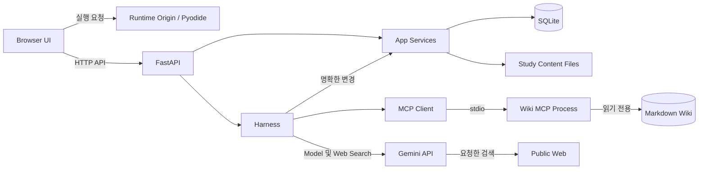
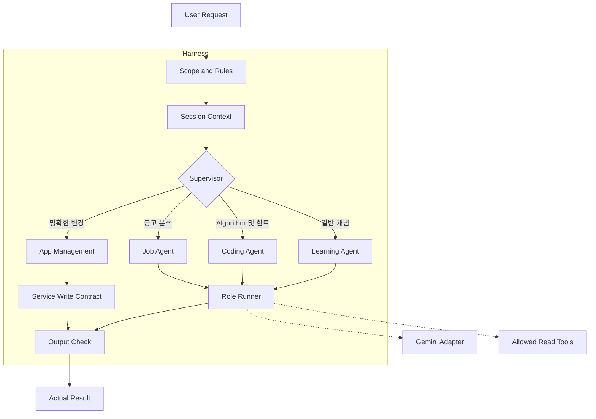
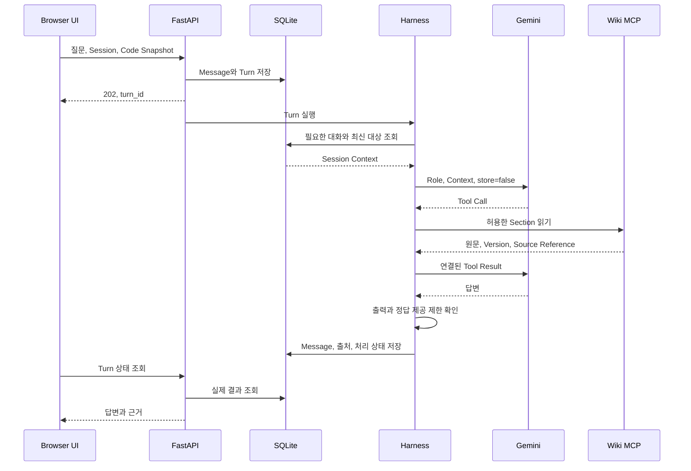

# Architecture

개정일: 2026-10-04
공식 API 근거 확인일: 2026-10-04
상태: 기술 선택과 논리 계약 확정. App 설치 및 통합 실행 검증은 아직 없다.

이 문서는 기술 Stack, Module, 저장, API와 AI 실행 계약을 관리한다.
Release 범위는 [Project Plan](./PROJECT_PLAN.md)을 따른다.
제품 동작과 완료 조건은 [PRD](./PRD.md)를 따른다.
사용 순서는 [User Flow](./USER_FLOWS.md)에 있다.
작성 규칙은 [DOCUMENTATION_STYLE](./DOCUMENTATION_STYLE.md)를 따른다.

## 1. 구조 원칙

하나의 Local Backend에 API, Service, Agent와 Harness를 둔다.
Wiki MCP만 같은 Python 환경의 별도 Child Process로 실행한다.
사용자 Python은 Browser의 별도 Origin에서 실행한다.
UI와 Chat의 변경은 같은 Service를 호출한다.
기존 Wiki와 사용자 Page의 원본을 구분한다.
각 Agent에 별도 Server와 Memory Database를 만들지 않는다.

MCP는 연결 Protocol이다.
RAG는 검색한 자료를 Context로 사용해서 답변하는 흐름이다.
MCP Tool로 Keyword Search를 호출하는 Baseline부터 사용할 수 있다.
Embedding과 Hybrid Search의 Index는 후속 실험에서만 추가한다.

## 2. System Diagram

Diagram은 계획한 경계와 연결을 표시한다.
현재 실행 중인 App을 뜻하지 않는다.


<details>
<summary>Mermaid Source</summary>

<!-- diagram: system-architecture -->



</details>

Runtime iframe은 App과 다른 Origin을 사용한다.
Runtime은 Wiki, Database와 Model API Key를 받지 않는다.
Diagram의 App Services는 Page, Study, Practice, Task와 Session Service를 뜻한다.
후속 Calendar와 Job도 같은 Backend에 추가한다.

## 3. 기술 Stack

이 표는 현재 기술 선택의 기준이다.
다른 문서에서 별도 Version 표를 유지하지 않는다.
Package의 정확한 설치 Version은 R0의 Lock File에 기록한다.

| 영역 | 선택 | 책임 |
|---|---|---|
| Frontend | React, TypeScript, Vite | Browser UI와 화면 연결 |
| Backend | Python 3.12, FastAPI, Pydantic | HTTP 계약과 업무 처리 |
| Database | SQLite, sqlite3, SQL Migration | 사용자 Data와 저장 계약 |
| Model | google-genai, Interactions API | 공통 Model 연결과 Tool Calling |
| 초기 Model 설정 | gemini-3.8-flash | 변경 가능한 기본 Model ID |
| MCP | 공식 mcp Python SDK v2, MCPServer, Client, stdio | Wiki 연결과 실제 Protocol 처리 |
| Page Editor | BlockNote 일반 Core | Block 편집과 내부 순서 변경 |
| Wiki Viewer | react-markdown, remark-gfm | 읽기 전용 Markdown 표시 |
| Wiki Parser | markdown-it-py, PyYAML safe_load | Frontmatter, Heading과 본문 분석 |
| Code Editor | Monaco Editor | Code Draft 편집 |
| Python Runtime | Pyodide module Web Worker | Browser의 기초 Python 실행 |
| Calendar | FullCalendar Standard React | Event 표시와 시간 이동 |
| Widget Layout | React-Grid-Layout v2 | 외부 Drop, 이동과 크기 변경 |
| 검증 | pytest, Playwright | 저장 및 Tool 계약과 Browser 흐름 |
| 환경 | uv, npm, Lock File | 의존성 설치와 Version 고정 |
| 문서 Diagram | Mermaid, beautiful-mermaid | 문서 Source와 SVG 생성 |

공식 MCP 문서는 v2의 MCPServer와 Client 구성을 제공한다.
이 Project는 독립 fastmcp Package를 추가하지 않는다.
과거 SDK의 FastMCP 예제를 현재 API와 섞지 않는다.
SDK Version과 MCP Protocol Revision은 별도로 기록한다.
[공식 MCP Python SDK](https://py.sdk.modelcontextprotocol.io/)

Gemini의 Interactions API와 초기 Model ID는 공식 문서에서 확인했다.
store=false로 App이 대화를 관리한다.
Provider의 previous_interaction_id에 대화 복원을 의존하지 않는다.
Tool Call 연결에 필요한 Call ID와 Opaque Metadata는 유지한다.
이 설정을 Provider의 모든 Data 처리 및 보관 중단으로 해석하지 않는다.
[Gemini Interactions API](https://ai.google.dev/gemini-api/docs/interactions-overview)

Next.js, Redux, LangGraph, Redis와 PostgreSQL은 초기 구성에 추가하지 않는다.
각 기능은 작은 Module과 명시한 Function 호출로 연결한다.
문서 Renderer는 App Runtime의 의존성이 아니다.

## 4. Directory와 Module

Source Directory는 구현을 위한 자리다.
실제 App Code File과 Package 설정은 아직 없다.
문서 Diagram 생성 Script는 App 구현과 별개다.
문서 Diagram의 생성물은 docs/diagrams에 둔다.

```text
MCP_project/
├── AGENTS.md
├── README.md
├── .gitignore
├── docs/
│   ├── PROJECT_PLAN.md
│   ├── PRD.md
│   ├── ARCHITECTURE.md
│   ├── USER_FLOWS.md
│   ├── DOCUMENTATION_STYLE.md
│   ├── PROJECT_REVIEW.md
│   ├── diagrams/
│   └── research/
├── frontend/
│   ├── src/
│   │   ├── app/
│   │   ├── features/
│   │   │   ├── chat/
│   │   │   ├── wiki/
│   │   │   ├── pages/
│   │   │   ├── study/
│   │   │   ├── practice/
│   │   │   └── tasks/
│   │   └── shared/
│   ├── runtime/
│   └── tests/e2e/
├── backend/
│   ├── src/learning_app/
│   │   ├── api/
│   │   ├── services/
│   │   ├── db/migrations/
│   │   ├── agents/skills/
│   │   ├── harness/
│   │   ├── tools/
│   │   ├── integrations/
│   │   └── wiki_mcp/
│   └── tests/
├── content/
│   ├── study_units/
│   └── practice_problems/
└── scripts/
```

| 위치 | 책임 |
|---|---|
| frontend/src/app | 시작, 화면 연결과 공통 설정 |
| frontend/src/features | 해당 기능의 UI와 상태 |
| frontend/src/shared | 실제로 여러 기능이 공유하는 UI와 API Client |
| frontend/runtime | 별도 Origin의 iframe과 Worker Source |
| backend/src/learning_app/api | HTTP 입력 검증과 응답 변환 |
| backend/src/learning_app/services | 실제 조회, 저장과 변경 |
| backend/src/learning_app/db | SQLite 연결, Migration, Transaction과 Backup |
| backend/src/learning_app/agents | 세 Role의 지침과 Tool 허용 목록 |
| backend/src/learning_app/agents/skills | App이 직접 읽는 작업 절차 Markdown |
| backend/src/learning_app/harness | Supervisor, Context, Rules, Hook, 실행과 취소 |
| backend/src/learning_app/tools | Tool Call과 Service의 Adapter |
| backend/src/learning_app/integrations | Gemini, Web Search와 MCP Client 연결 |
| backend/src/learning_app/wiki_mcp | 읽기 전용 Wiki MCP Server |
| content | 자체 Study Unit과 기초 문제의 JSON 정의 및 Markdown 설명 |
| scripts | 실제 Windows 시작, Backup과 문서 Diagram 생성의 진입점 |

Calendar, Planner, Job과 Layout Directory는 해당 기능 구현 시 추가한다.
한 기능에만 쓰는 File을 shared에 모으지 않는다.
Frontend 의존성은 frontend/package.json과 package-lock.json에서 관리한다.
Backend 의존성은 backend/pyproject.toml과 uv.lock에서 관리한다.
Wiki MCP용 두 번째 Python 환경을 만들지 않는다.

## 5. Data 원본과 저장 계약

| Data | 원본 | 주요 식별 및 값 | 변경 담당 |
|---|---|---|---|
| Wiki Note | 기존 Markdown File | collection, note_id, file_version, Section | 원래 Wiki 관리 방식 |
| Page | SQLite의 Block JSON | page_id, kind, title, blocks, metadata, revision | Page Service |
| Coding Record | 같은 Page | 문제 URL과 사용자 기록 Metadata | Page Service |
| Code Draft | SQLite | 대상 ID, Code, 수정 시각 | Practice Service |
| Code Snapshot | Turn 또는 Attempt의 사본 | 대상 ID, Code, 생성 시각 | 요청을 받는 Service |
| Attempt | SQLite | Problem 및 Runtime Version, Snapshot, 실제 결과 | Practice Service |
| Task | SQLite | task_id, title, status, due_date, target_ref, revision | Task Service |
| Session | SQLite | session_id, 제목, 활성 Context | Session Service |
| Turn 및 Message | SQLite | session_id, turn_id, role, 내용, 상태, 필요한 Tool 연결 정보 | Session Service 및 Harness |
| Settings | SQLite와 별도 비밀 설정 | 사용자 선택과 App 설정 | Settings Service |
| Study Unit | content의 JSON 및 Markdown | concept_id, domain, level, prerequisite_ids, objectives, activities, source_refs, version | Project 내용 작성 |
| Practice Problem | content의 JSON 및 Markdown | problem_id, version, Function 계약, 제약, Test Case | Project 내용 작성 |
| Event | 후속 SQLite | event_id, task_id, start_at, end_at, timezone, revision | Calendar Service |
| Planner Settings | 후속 SQLite | 목표, 가능 시간과 사용자 입력 예상 시간 | Planner Service |
| Job | 후속 SQLite | job_id, URL, 요구사항 근거, 지원 상태, 확인 시각, revision | Job Service |
| Layout | 후속 SQLite | Widget ID, 대상 참조, 위치와 크기 | Layout Service |
| 실험 Index | E1의 파생 File | 원문 Version, Section, Embedding Model 및 설정 | 실험 Index 생성 경로 |

Page와 별도의 Note Data Entity를 만들지 않는다.
Widget은 원본 Data를 복제하지 않고 ID로 참조한다.
외부 Coding Test용 Attempt 저장소를 따로 만들지 않는다.
Session Context의 ID는 참조이며 Page와 Task의 원본 사본이 아니다.
새 요청에서는 필요한 원본을 다시 조회한다.
Study Unit의 난이도는 사용자가 선택한 학습 수준이다.

Task 상태는 open, done, archived다.
보관 이전 상태를 남겨 복원한다.
Task 마감은 기본 시간대의 선택적 날짜다.
Event의 시작과 종료는 UTC 시각으로 저장하고 timezone으로 표시한다.
Event 이동과 삭제는 연결 Task의 마감을 바꾸지 않는다.
시간 겹침은 표시하되 사용자의 명시한 배치를 임의로 바꾸지 않는다.

변경은 expected_revision과 실제 revision을 비교한다.
불일치하면 conflict를 반환하고 최신 값과 사용자 Draft를 보존한다.
request_id는 변경 요청과 Payload를 식별한다.
같은 ID와 같은 Payload의 재시도는 저장한 처리 결과를 반환한다.
같은 ID를 다른 Payload로 사용하면 validation_error를 반환한다.
Transaction으로 변경과 처리 결과를 함께 저장한다.
Model은 SQL과 임의 File 쓰기를 직접 수행하지 않는다.

## 6. HTTP API 계약

API와 Function Tool은 같은 Service를 호출한다.
아래 Route는 구현할 논리 계약이다.
실제 OpenAPI와 Pydantic Schema는 해당 기능 구현 시 함께 작성하고 검증한다.
입력, 상태와 오류를 정의하지 않은 Route를 구현 완료로 표시하지 않는다.

| 경로 | 입력 | 출력 또는 상태 변화 |
|---|---|---|
| GET /api/wiki/notes | collection, query, cursor, limit | 목록, Source Reference와 Collection 오류 |
| GET /api/wiki/note | note_id, section_id, file_version, cursor | 원문 구간 또는 변경 및 읽기 오류 |
| GET /api/study/units | domain, level | 작성한 Study Unit 목록 |
| GET /api/pages/{page_id} | Page ID | 최신 Page와 revision |
| POST /api/pages | 내용, request_id | 저장한 Page |
| PATCH /api/pages/{page_id} | 변경, expected_revision, request_id | 저장한 Page 또는 conflict |
| GET /api/tasks | 상태와 선택적 대상 | Task 목록 |
| POST /api/tasks | 작업, 선택적 마감과 대상, request_id | 저장한 Task |
| PATCH /api/tasks/{task_id} | 변경, expected_revision, request_id | 저장한 Task 또는 conflict |
| GET 또는 POST /api/sessions | 조회 조건 또는 새 Session 요청 | Session 목록 또는 새 Session |
| GET /api/sessions/{session_id}/messages | cursor, limit | 해당 Session의 Message |
| PATCH /api/sessions/{session_id}/context | 변경할 참조와 요청 설정 | 검증한 Session Context |
| DELETE /api/sessions/{session_id} | Session ID, request_id | 대화 삭제 결과 |
| POST /api/sessions/{session_id}/turns | 질문, Context 선택, Code Snapshot, request_id | 202와 turn_id |
| GET /api/turns/{turn_id} | Turn ID | 처리 상태, 확인 가능한 Trace와 최종 결과 |
| POST /api/turns/{turn_id}/cancel | Turn ID, request_id | 취소 요청과 실제 처리 상태 |
| PUT /api/practice/drafts/{target_id} | Code와 revision | 저장한 Draft |
| POST /api/practice/attempts | 실행 Snapshot, Version과 Browser 결과 | 저장한 Attempt |

같은 Session의 활성 AI Turn은 하나다.
Backend는 한 Process에서 해당 Session의 실행을 순서대로 관리한다.
UI는 활성 Turn의 상태를 조회하고 완료 응답을 표시한다.
상태 조회 간격은 설정에서 읽는다.
초기에는 Token Streaming과 별도 Queue Service를 요구하지 않는다.
Backend 재시작 시 완료되지 않은 Turn은 interrupted로 표시한다.
변경 이력을 확인하지 않고 해당 Turn을 자동 재실행하지 않는다.

Turn 상태는 queued, running, cancel_requested, completed, cancelled, failed, interrupted다.
취소 후 이미 저장한 변경은 처리 결과에 남긴다.
성공 응답은 actual_result와 현재 저장값에 근거한다.
실패 응답은 error_code, 설명, 재시도 가능 여부와 필요한 대상 ID를 가진다.
오류 종류는 validation_error, not_found, conflict, source_changed, permission_denied,
connection_error, provider_error, timeout, cancelled를 구분한다.
후속 Event, Planner, Job과 Layout API도 같은 계약 원칙을 사용한다.

## 7. Wiki MCP 계약

Backend는 Host이며 MCP Client를 관리한다.
Client는 stdio로 Wiki MCP Child Process에 연결한다.
연결, 발견, 요청과 종료는 SDK API로 처리한다.
Protocol Handshake를 직접 작성하지 않는다.
stdout은 MCP 통신에만 사용한다.
일반 기록은 stderr로 보낸다.

| 제공 항목 | 입력 | 결과 |
|---|---|---|
| list_notes | collection, cursor, limit | Note ID, 제목, Alias, Tag와 다음 Cursor |
| search_notes | query, collection, limit | 검색 근거 구간, 순위와 Index 상태 |
| get_headings | note_id | Heading 경로, Section ID, 줄 위치와 File Version |
| read_note | note_id, 선택적 section_id, file_version, cursor | 원문 구간, Source Reference와 다음 Cursor |
| Resource wiki://index | Resource URI | Collection과 자료 탐색 정보 |
| Prompt explain_from_wiki | 주제와 선택한 Note 참조 | 자료 기반 설명의 재사용 지침 |

Resource와 Prompt는 실제 조회 예제로 사용한다.
등록했다는 이유로 Model Context에 자동 포함하지 않는다.
다른 App 기능은 일반 Function Tool로 연결한다.
Programmers 전용 MCP Server는 추가하지 않는다.

Collection은 ai_terms, ai_usage, algorithms다.
Root Directory는 Local 설정에서 전달한다.
AI-IT용어는 wiki와 index.md를 기본 대상으로 사용한다.
raw, _meta, Backup과 숨김 File은 제외한다.
Note ID는 Collection과 허용 Root 안의 상대 경로로 식별한다.
Model에는 실제 절대 File Path를 전달하지 않는다.
최종 경로가 허용 Root 안에 있는지 검사한다.
Root 밖의 Junction과 Path Traversal을 허용하지 않는다.

제목은 Frontmatter title, 첫 H1, File Name 순서로 정한다.
검색어의 Unicode와 대소문자를 정규화한다.
제목 및 Alias의 일치를 본문보다 우선하고 같은 순위는 Note ID로 정렬한다.
초기 Index는 Memory에 두고 시작 및 수동 Refresh 시 갱신한다.
별도 File Watcher와 Vector Database를 만들지 않는다.
File Version은 실제 내용의 Hash로 식별한다.
읽을 때 현재 Version을 확인한다.

Source Reference는 source_type, note_id, section_id, file_version과 원문 줄 위치를 가진다.
Code Fence 안의 문자열을 Heading으로 분석하지 않는다.
같은 Heading 이름은 Section ID와 줄 위치로 구분한다.
Version이 바뀌어 ID와 Cursor가 무효이면 source_changed를 반환한다.
Client는 목차와 최신 구간을 다시 조회한다.
stable과 draft는 작성 상태이며 사실 검증 결과가 아니다.
검색 실패와 정상적인 빈 결과를 구분한다.
일부 Collection 실패와 검색 Index의 갱신 시각을 반환한다.

## 8. Harness와 Supervisor

Harness는 Supervisor와 Agent의 전체 실행을 감싼다.
Scope Check, Context, Model, Tool, 제한, 취소와 출력 검증을 포함한다.


<details>
<summary>Mermaid Source</summary>

<!-- diagram: supervisor-routing -->



</details>

이 Diagram은 경로와 책임의 관계다.
Service Write Contract는 입력 검증과 실제 App Service 호출을 포함한다.
Tool Call의 실제 실행 순서는 아래 Sequence를 따른다.
Supervisor는 현재 명시한 목적을 먼저 확인한다.
UI와 Session Context는 생략한 대상과 조건을 보완한다.
목적이 분명하면 바로 Role 또는 App 관리 경로를 선택한다.
모호한 목적과 대상에만 짧은 분류 또는 확인 질문 한 개를 사용한다.
모든 요청에 분류 Model을 추가 호출하지 않는다.
Supervisor가 최종 답변을 다시 작성하지 않는다.
복합 요청만 최대 두 Role을 순서대로 연결한다.
재귀 위임과 임의의 Agent 생성은 허용하지 않는다.

| 구성 | 구현할 책임 |
|---|---|
| Agent | Role 설정을 받은 공통 실행기 |
| Skill | 작업 절차와 출력 기준을 담은 App Markdown |
| Memory | 공통 Session, Message와 사용자가 명시한 Settings |
| Rules | 지원 범위, 출처, 정답 제공 제한과 Tool 권한 |
| Hook | 입력 및 출력 검증, 최소 Trace와 취소 확인의 Code Function |
| Tool | 실제 검색, 읽기, 조회와 변경 Function |
| MCP | Wiki 제공자와 App 사이의 연결 |
| Harness | 위 구성의 실행 순서와 제한 |

App Skill은 Codex Skill과 별개다.
App은 필요한 Skill을 직접 읽는다.
외부 문서와 Web Page를 새 Rules로 사용하지 않는다.
Hook은 사용자 Code와 Shell Command를 실행하지 않는다.
범용 Hook 등록 System은 만들지 않는다.

### Role과 권한

| Role 또는 경로 | 목적 | 허용 Tool |
|---|---|---|
| Learning Agent | AI, Data, Backend와 일반 CS 설명 및 피드백 | Wiki 읽기 및 검색, 요청한 Web Search와 URL 읽기 |
| Coding Agent | algorithm 및 coding_test 학습 안내 | Wiki 읽기 및 검색 |
| Job Agent | 공고 근거와 명시한 경험 및 준비 후보 연결 | 요청한 공고 검색, URL 읽기와 관련 Wiki 조회 |
| App 관리 경로 | 사용자가 명확히 요청한 Page, Task와 일정 변경 | 같은 Service의 제한된 변경 Function |

Role Runner의 Model 호출과 Tool 실행은 공통 Harness를 사용한다.
Python 문법은 Algorithm 또는 Coding Test의 선행 내용이면 Coding Agent에서 설명한다.
다른 개발 학습의 문법, 설치와 오류 해결은 Learning Agent에서 설명한다.
개념 이름만으로 Role을 선택하지 않는다.
변경 Tool을 세 학습 Role에 직접 제공하지 않는다.
선택한 Page와 Code Snapshot은 Harness가 필요한 범위로 전달한다.
Job 분석만 요청했으면 Learning Agent를 자동 호출하지 않는다.
공고 분석과 기술 설명을 함께 요청했을 때만 두 Role을 연결한다.

### Coding Context와 정답 제공 제한

Concept Reference는 검토한 Note ID, Section ID와 내용 Version을 지정한다.
허용 구간은 content의 학습 정의에서 관리한다.
같은 규칙을 Prompt와 검색 Module에 따로 복제하지 않는다.
File Version이 바뀌면 이전 검토 결과를 그대로 신뢰하지 않는다.
검토가 필요한 구간은 Context에서 제외하고 상태를 표시한다.

기준 풀이, 정답이 있는 확인 항목과 문제별 추천 풀이를 Context에서 제외한다.
Section 제목만으로 내용의 허용 여부를 판정하지 않는다.
검색 결과를 Model에 전달하기 전에 허용 구간을 검사한다.
Coding Agent의 read_note 요청도 같은 허용 범위를 검사한다.
일반 UI Wiki Viewer의 읽기 권한과 Coding Agent의 Context 권한은 구분한다.

현재 문제의 정답 제공 제한은 대상과 Session에 연결한다.
Role 이름과 learning_goal 변경만으로 제한을 해제하지 않는다.
이전 힌트가 전체 답안으로 이어지는지도 확인한다.
독립된 일반 개념과 문법 설명은 허용한다.
Output Hook은 형식, 실제 출처와 확인 가능한 위반을 검사한다.
위반한 응답은 그대로 표시하지 않고 학습 안내로 제한한다.
의미상의 풀이 제공은 실제 질문과 Multi-turn 사례로 사람이 검토한다.

## 9. Multi-turn과 Context

Session Context는 활성 대상과 사용자가 명시한 요청 조건을 저장한다.

| 값 | 의미 |
|---|---|
| study_unit_id | 현재 단원 |
| source_refs | 선택한 Wiki 및 실제 근거 |
| coding_record_page_id | 선택한 보조 문제 기록 |
| code_target_ref | 현재 Code의 대상 |
| problem_context_key | 기록이 없는 질문도 포함한 현재 문제의 연결 식별자 |
| source_mode | wiki 또는 wiki_web |
| explanation_level | 기초, 응용, 심화의 사용자 선택 |
| learning_goal | concept, algorithm, coding_test, job |
| hint_level | 확인 질문, 개념 설명, 문법 예제, 부분 점검 |

새 문제를 명시하거나 다른 Coding Record를 선택하면 문제 Context를 갱신한다.
다른 문제의 Code와 조건을 해제한다.
기록이 없는 첫 Coding Test 질문도 problem_context_key를 가진다.
문제 요약은 사용자가 제공한 조건만 포함한다.
원문을 확인하지 않은 조건을 보충해서 사실로 저장하지 않는다.
Code는 Turn 시작 시 Snapshot으로 고정한다.
편집 중인 현재 Code와 이미 질문한 Code를 구분한다.

Context에는 현재 질문, 필요한 최근 Message, 선택 자료와 최신 Data를 넣는다.
모든 Message를 매번 보내지 않는다.
Tool Call과 Result의 쌍을 중간에서 끊지 않는다.
오래된 내용이 필요하면 해당 Session의 Message를 제한해서 다시 읽는다.
전송에서 제외한 과거 내용을 확인 없이 기억한다고 설명하지 않는다.
자동 Summary, Vector Memory와 추정 Profile은 초기 구현에 추가하지 않는다.
대화, 실제 Tool 연결 Metadata와 필요한 실행 상태만 저장한다.
API Key와 Model의 내부 추론 본문은 저장하지 않는다.


<details>
<summary>Mermaid Source</summary>

<!-- diagram: multi-turn-sequence -->



</details>

## 10. Web Search 계약

기본 source_mode는 wiki다.
명시한 검색 요청과 wiki_web에서만 공개 웹 자료를 사용한다.
Google Search와 URL Context를 google-genai로 연결한다.
검색 결과를 받은 뒤 Role 입력에 전달하는 순차 처리를 사용한다.
여러 종류의 Tool을 한 API Call에 결합하는 기능을 필수 조건으로 삼지 않는다.
[Google Search 공식 문서](https://ai.google.dev/gemini-api/docs/google-search)

실제 URL, 조회 상태, 확인 시각과 Provider의 Source Metadata를 유지한다.
Provider의 Search Suggestions 표시 조건은 구현 시 공식 계약으로 확인한다.
반환된 사용량만 표시한다.
내부 Google Search 호출 수를 App Tool 수와 같은 값으로 계산하지 않는다.
URL은 공개 HTTP 및 HTTPS 대상으로 제한한다.
Local File, 내부 주소와 App API를 URL 읽기의 대상으로 사용하지 않는다.
저장과 분석 요청을 구분한다.
읽지 못한 문제 URL이 Coding Record 저장을 막지 않는다.

## 11. Python Runtime 계약

Monaco Editor는 Code 편집만 담당한다.
Pyodide module Web Worker는 별도 Origin의 iframe에서 실행한다.
Runtime은 정적 실행 자산을 제공하며 App 업무 API를 제공하지 않는다.
API Key, App Database와 Wiki File을 전달하지 않는다.
Directory 분리만으로 접근 경계가 완성됐다고 판단하지 않는다.

Parent와 iframe은 허용 Origin과 창의 Message Source를 검사한다.
Message는 type, request_id, Runtime Version과 정해진 Payload를 가진다.
허용하지 않은 type, 다른 request_id와 크기 초과 Payload를 거절한다.
Runtime CSP와 Worker의 네트워크 접근 범위를 실제로 확인한다.
App API는 Runtime Origin의 변경 요청을 허용하지 않는다.
Cookie의 Port 차이만으로 격리됐다고 가정하지 않는다.
[Pyodide Web Worker](https://pyodide.org/en/stable/usage/webworker.html)
[Pyodide 실행 환경](https://pyodide.org/en/stable/usage/faq.html)

실행 전에 Draft를 저장한다.
초기 실습은 Python Standard Library의 작은 Function과 JSON으로 비교 가능한 값을 사용한다.
사용자 출력과 Test Case 결과는 분리한다.
실행마다 새 Namespace를 사용한다.
Namespace 초기화가 모든 Package 상태 초기화를 뜻하지는 않는다.
중단과 실행 오류 뒤에는 필요하면 Worker를 다시 만든다.
Browser Memory의 강제 상한을 보장하지 않는다.

기준 풀이와 틀린 풀이로 빈 입력, 중복과 경계 조건을 검토한다.
Runtime 준비 시간은 실제 Code 실행 제한과 분리한다.
사용자 Code를 FastAPI에서 exec하지 않는다.
AI가 만든 Code와 외부 Code를 자동 실행하지 않는다.
초기에는 REPL과 사용자 입력 대기를 제공하지 않는다.
stdin과 stdout은 실제 기초 학습에 필요할 때 검토한다.
Runtime 자산 준비 전에는 완전한 Offline 실행을 약속하지 않는다.

## 12. 설정과 실행 제한

변경 가능한 값은 하나의 설정 계약에서 읽는다.
Frontend에 필요한 공개 설정만 별도 응답으로 전달한다.
비밀값을 문서, Browser와 기본 Log에 쓰지 않는다.

| 설정 | 초기값 또는 기준 |
|---|---|
| APP_DATA_DIR | %LOCALAPPDATA%/MCP_project |
| APP_TIMEZONE | Asia/Seoul |
| Wiki Root 설정 | 허용한 세 Collection의 실제 Directory |
| GEMINI_MODEL | gemini-3.8-flash |
| GEMINI_API_KEY | Backend의 비밀 Environment Variable |
| App 및 Runtime Origin | 서로 다른 Origin, Local 전용 |
| Turn 실행 제한 | 120초 |
| Turn Model 호출 제한 | 4회 |
| Turn App Tool 실행 제한 | 8회 |
| 입력 크기 제한 | 60,000자 |
| 최종 답변 제한 | 4,096 Token |
| 검색 결과 수 | 기본 10개, 최대 20개 |
| Wiki 읽기 응답 크기 | 최대 12,000자, Cursor로 다음 구간 조회 |
| 작은 Python Function 실행 제한 | 3초 |
| Python 출력 제한 | 64 KiB |

제한은 각 Role에 따로 주지 않고 Turn 전체에 적용한다.
분류, Web Search 단계와 복합 Role 호출을 함께 계산한다.
문자 수와 Tool 수는 실제 요금의 상한이 아니다.
제한 초과를 숨기고 추가 호출하지 않는다.
중단은 남은 App 실행을 멈춘다.
이미 사용한 API 비용과 완료된 변경을 취소됐다고 표시하지 않는다.
Auth Error는 재시도하지 않는다.
일시적인 읽기 실패만 제한적으로 재시도한다.
변경은 실제 결과를 확인하지 않고 반복하지 않는다.

## 13. Local 저장, Backup과 종료

활성 SQLite는 기본 APP_DATA_DIR에 둔다.
OneDrive Project 안에는 실행 중 Database를 두지 않는다.
설치물과 사용자 Data는 Project Source에 포함하지 않는다.
SQLite Backup API로 일관된 Backup을 만든다.
Backup은 Schema Version과 App 저장 Data의 연결 관계를 보존한다.
원래 Wiki와 API Key는 포함하지 않는다.

Restore는 App을 종료한 상태에서 수행한다.
Schema와 File의 유효성을 먼저 검증한다.
검증 실패 시 기존 Database를 교체하지 않는다.
적용 전 현재 Data를 보존하고 결과를 다시 확인한다.
Restore 후 Wiki Directory 설정과 출처 Version을 확인한다.
Markdown은 읽기와 이동용 Export이며 원형 복원 형식이 아니다.
[BlockNote Markdown 변환](https://www.blocknotejs.org/docs/features/import/markdown)

Windows의 한 실행 진입점이 Frontend, Backend와 Runtime 준비를 처리한다.
Backend가 Wiki MCP Child Process의 연결과 종료를 관리한다.
종료 시 활성 Turn 상태, Database 연결과 Child Process를 정리한다.
시작 실패는 해당 경계의 실패로 표시한다.
Model과 MCP 오류가 Page 편집과 Task 수동 관리를 막지 않는다.
App은 127.0.0.1에 바인딩한다.
HTTP 변경은 허용 Origin과 CSRF Token을 검사한다.
범용 분산 Lock, 운영 Monitoring과 배포 자동화는 추가하지 않는다.

## 14. 후속 RAG 비교 실험

Baseline은 제목, Alias, Tag 및 본문의 Keyword Search와 필요한 Section 읽기다.
Markdown 원본의 일괄 정제와 형식 변환을 요구하지 않는다.
Heading과 Metadata를 읽는 가벼운 Parsing은 Baseline에도 필요하다.
Embedding 검색을 실험할 때만 Section 분할, Embedding과 파생 Index를 추가한다.

기존 search_notes의 계약을 유지하고 내부 검색 방식만 비교한다.
새 RAG Agent, 별도 MCP Server와 전용 Vector Database를 먼저 추가하지 않는다.
실험 Index는 APP_DATA_DIR 아래의 별도 실험 영역에서 관리한다.
문서 수정과 삭제 시 해당 Version의 Section 및 Embedding을 갱신하거나 제거한다.
파생 Index는 원본 Wiki에서 다시 만들 수 있다.
기본 App Backup의 필수 원본 Data로 취급하지 않는다.

| 비교 대상 | 확인할 내용 |
|---|---|
| Keyword Search | 정확한 용어, Alias와 Heading을 찾는 Baseline |
| Embedding Search | 다른 표현의 질문에서 관련 개념을 찾는 효과 |
| Hybrid Search | 정확한 용어와 의미 기반 검색을 함께 쓰는 효과 |

Section은 Heading 경로와 의미 단위를 기준으로 나눈다.
Code Block을 중간에서 잘라 의미를 바꾸지 않는다.
문서 제목, Heading 경로, Note ID와 File Version을 보존한다.
Index 생성 전과 Model에 Context를 전달하기 전에 Coding 허용 범위를 유지한다.
알고리즘 원문의 완성 풀이를 검색 대상에 무조건 추가하지 않는다.

실험은 다음 순서로 수행한다.

1. 실제 질문과 기대하는 Note 및 Section을 기록한다.
2. 문서 집합과 Version을 고정한다.
3. 각 검색 방식의 Model, Prompt, Context 예산과 결과 수를 같게 유지한다.
4. 기대 근거의 검색 여부와 답변의 근거 일치를 검토한다.
5. 없는 자료, 문서 수정 및 삭제, 정답 노출과 Multi-turn 힌트도 검토한다.
6. 응답 시간, Index 생성 비용과 확인 가능한 API 사용량을 기록한다.
7. 검색 실패, 근거 선택 실패와 답변 해석 오류를 구분한다.
8. 적용 범위와 기본 검색 변경 여부를 결정한다.

Embedding Model, Index 형식과 검색 결합 설정은 E1 실행 전에 정하고 결과에 기록한다.
이를 현재 설치 완료 기술로 표시하지 않는다.
Reranking은 실제 검색 실패에서 필요가 확인될 때 검토한다.
측정 없이 다른 자료의 개선률을 이 App의 효과로 사용하지 않는다.
[Keyword와 Embedding의 비교 근거](https://www.anthropic.com/engineering/contextual-retrieval)

## 15. Trace와 검증

Trace에는 Tool 이름, 대상 ID, 성공 여부, 소요 시간과 Source Reference를 남긴다.
요청 상태와 확인 가능한 Provider 사용량을 함께 표시한다.
개인 Code, 공고 본문과 대화 전체를 기본 Log에 복제하지 않는다.
Model의 내부 추론을 Trace로 표시하지 않는다.

pytest는 저장, Revision, 중복 요청, Source Version과 Tool 권한을 확인한다.
Playwright는 한글 입력, 저장 복원, Chat Context와 Runtime 조작을 확인한다.
의미상의 정답 제공과 학습 도움은 작은 실제 질문으로 사람이 검토한다.
별도 평가 Agent와 Analytics Framework를 추가하지 않는다.
기대 동작을 문서에 적었다는 이유로 Test 통과를 보고하지 않는다.

R0에서는 Windows SDK 연결, Provider Metadata와 Runtime 경계를 검증한다.
검증에 성공한 설치 Version을 Lock File에 고정한다.
기능을 구현하기 전에 입력, 출력, 권한, 실패와 완료 조건을 확인한다.
검증이 필요한 경계를 조용한 Fallback으로 숨기지 않는다.

## 16. Diagram 표현과 근거

문서 Diagram은 Mermaid의 Flowchart와 Sequence 문법을 사용한다.
표준 Source를 문서에 남기고 같은 Source로 SVG를 생성한다.
색상과 간격은 docs/diagrams의 공통 설정으로 관리한다.
Diagram마다 App 기능과 실행 경계를 구분한다.
하나의 Diagram에 모든 Module과 API를 넣지 않는다.

[beautiful-mermaid](https://github.com/lukilabs/beautiful-mermaid)는 Theme를 적용한 SVG 생성을 지원한다.
이 문서는 문서 생성에만 해당 Renderer를 사용한다.
사용한 Renderer Version은 1.1.3이다.
scripts/render_docs.mjs는 문서의 같은 Source로 네 SVG를 생성한다.
설정은 docs/diagrams/diagram-config.json에서 읽는다.
manifest.json은 Source와 SVG의 Hash 및 생성 Version을 기록한다.
Renderer의 설치 Directory는 실행 Argument로 전달한다.
App의 package.json과 pyproject.toml에는 추가하지 않는다.
공식 Mermaid의 Theme 기능도 Source 표현의 대안이다.
[Mermaid Theme 문서](https://mermaid.js.org/config/theming.html)
지원하지 않는 신규 Diagram 문법을 사용해서 문서의 호환성을 낮추지 않는다.
