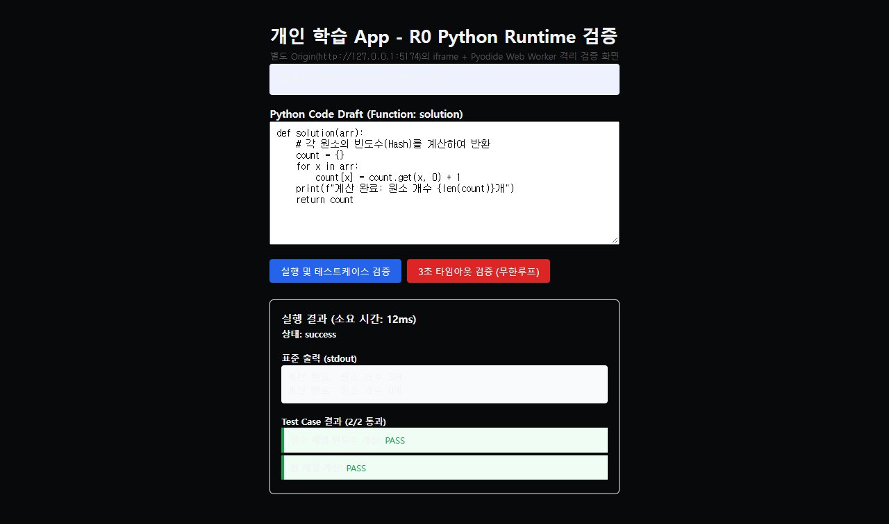

# 현재 구현의 종합 검토

작성일: 2026-10-05
검토 기준: `db19f07`의 App Source와 검토 시점 Working Tree.
검토 범위: R0의 Wiki MCP, 저장 Service, HTTP API, Backup, Python Runtime, Test, 설정과 UI.
판단 기준: 개인 사용과 실제 공부 흐름.

## 1. 핵심 판단

현재 구현은 기술 경계를 확인하는 R0 App이다.
기존 Test는 Backend 96개와 Browser 6개가 통과했다.
그러나 추가 실행에서 App 변경 접근, Backup의 Data 보존과 동시 저장 경계가 실패했다.
README의 순서 4 완료 표시는 이 경계를 충분히 검증한 상태로 해석하면 안 된다.
Gemini 연결 전에 아래 P1 오류와 다음 단계에 영향을 주는 저장 계약을 보완할 필요가 있다.

3·4절의 실행 오류 목록은 B01부터 B21까지 21개다.
이 목록의 P1은 4개다. P2는 17개다.
별도로 Hardcoding, 누락된 구현, Gray 영역과 불필요한 추가 후보를 기록했다.
검토 기록은 새로운 Release 범위나 구현 약속이 아니다.

| 구분 | 의미 |
|---|---|
| P1 | App Data 접근 또는 보존의 실패, 핵심 저장 실패. 다음 연결 작업 전에 수정한다 |
| P2 | 특정 입력이나 조작에서 잘못된 결과를 반환한다. 해당 기능을 사용하기 전에 수정한다 |
| P3 | 유지보수와 설정의 일관성 문제. 실제 필요와 구현 순서에 맞춰 정리한다 |
| 실행 재현 | 임시 Data 또는 실제 Browser Runtime으로 결과를 확인했다 |
| Code 검토 | Source에서 경로와 계약을 확인했다. 해당 실패를 실행으로 확인하지 않았다 |
| 설계 판단 | 개인 사용 흐름과 기준 문서를 대조한 판단이다 |

App Source는 수정하지 않았다.
이 문서와 [UI Screenshot](./review-assets/runtime-ui-20261005.png)만 추가했다.
별도로 진행 중인 `AGENTS.md`, `docs/DESIGN.md`와 `.agents/` 변경은 보존했다.
검토 중 갱신된 Design v1.1도 다시 확인했다.
실제 사용자 Database와 원래 Wiki는 변경하지 않았다.

## 2. 실제 구현과 단계의 구분

현재 Release와 구현 순서는 [Project Plan](./PROJECT_PLAN.md)을 따른다.
각 기능의 완료 조건은 [PRD](./PRD.md)를 따른다.
선택 기술과 저장 계약은 [Architecture](./ARCHITECTURE.md)를 따른다.

| 영역 | 현재 확인한 구현 | 아직 완료로 판단할 수 없는 범위 |
|---|---|---|
| Wiki | 읽기 전용 Library, Keyword Search, Heading 및 Section 읽기, stdio MCP 연결 | 수동 Refresh, MCP 오류 분류, 실제 App 종료 경계, Viewer와 Chat 연결 |
| Page | Block JSON의 SQLite 저장, 목록, 수정, Revision, 일부 `request_id` 처리 | 실제 BlockNote의 편집·저장·재시작 Round Trip, 사용자 Draft 보존 UI |
| Task | 생성, 조회, 수정, 보관과 복원 Service | 이전 상태 복원, 선택 항목 삭제, 입력 검증, 실제 UI와 Chat 연결 |
| Session | Context와 `turns` Table 저장 | Message와 실행 Turn의 구분, 재시도 계약, 삭제 API, Harness 실행 상태 |
| Backup | SQLite Backup API로 File 생성, 일부 검증과 Restore | 호환 Schema와 연결 관계 검증, 실패 시 최신 Data 보존, 종료 상태의 Restore |
| Python Runtime | 별도 Origin의 iframe과 Worker, 실행, Timeout, stdout과 Test Case 분리 | API 접근 차단, Message 검증, UTF-8 Byte 제한, 준비 실패, Proxy 정리, 정확한 판정 |
| Frontend | R0 Runtime Fixture 화면과 CSS Token | R1의 Wiki·Page·Study·Practice·Task·Chat 사용 흐름 |
| Agent | 선택한 Package와 Directory Skeleton | Gemini Adapter, 공통 Harness, Role과 Tool 권한, 실제 Model 실행 |

Gemini Adapter와 Harness는 다음 순서 5의 작업이다.
R1 UI와 content, R2 Calendar·Repository, R3 Layout·통합 검색, E1 검색 실험의 부재는 현재 구현의 Bug로 분류하지 않았다.

## 3. 먼저 수정할 오류

### B01. [P1] Python Worker에서 App 변경 API를 호출할 수 있다

근거: [API Middleware](../backend/src/learning_app/api/main.py#L133), [Runtime 응답 Header](../frontend/vite.config.ts#L15), [iframe CSP](../frontend/runtime/index.html#L14).
연결 요구: FR-09, NF-02, Architecture §11·§13.
상태: 수정 완료 (2026-10-05). 기존 실행 재현 기록 보존.

재현 기록:
Backend는 CORS 응답 Header를 설정하지만 변경 요청의 Origin과 CSRF Token을 검증하지 않았다.
Worker의 Script 응답에는 CSP가 없었다.
iframe HTML의 CSP만으로 Worker의 App API 호출을 제한하지 못했다.

실제 Python의 `js` Bridge에서 `fetch(..., {method: 'POST', mode: 'no-cors'})`를 실행했다.
Fixture Backend의 Backup 수가 0개에서 1개로 증가했다.
응답 본문을 읽지 못해도 변경 요청은 수행됐다.
TestClient에서도 Runtime Origin을 가진 Page 생성과 단순 Backup POST가 각각 HTTP 201을 반환했다.

수정 내용:
1. `frontend/vite.config.ts`: Runtime Server(5174)의 HTTP 응답 Header에 CSP(`default-src 'none'; script-src 'self' 'unsafe-eval' https://cdn.jsdelivr.net; connect-src https://cdn.jsdelivr.net; worker-src 'self' blob:; style-src 'unsafe-inline';`)를 추가하여 Web Worker의 네트워크 접근을 `https://cdn.jsdelivr.net`으로 제한했다.
2. `backend/src/learning_app/api/main.py`: `validate_origin_and_csrf` 미들웨어를 추가하여 변경 요청(`POST`, `PUT`, `PATCH`, `DELETE`)에서 Runtime Origin(`http://127.0.0.1:5174`, `http://localhost:5174`) 및 비허용 Origin을 HTTP 403 Forbidden(`permission_denied`)으로 차단했다.

검증 결과:
- `backend/tests/test_api_security.py`: Runtime Origin의 Backup/Page/Task 변경 시도 시 403 차단 및 실제 DB/파일 미변경 검증 통과 (3개 테스트).
- `frontend/tests/e2e/python_runtime.spec.ts`: Runtime iframe(5174)에서 Backend로의 simple POST/no-cors fetch 시도가 브라우저 CSP connect-src에 의해 즉시 차단됨을 실제 Chromium 브라우저에서 검증 통과 (Playwright 7개 테스트 통과).

### B02. [P1] 호환되지 않는 Backup을 검증 성공으로 처리한다

근거: [Backup 검증](../backend/src/learning_app/services/backup_service.py#L79).
연결 요구: FR-20, Architecture §13.
상태: 수정 완료 (2026-10-05). 기존 실행 재현 기록 보존.

재현 기록:
기존 검증은 SQLite File 무결성과 네 개 Table의 이름만 확인했다.
Schema Version, Column, `turns`, `mutation_logs`와 Foreign Key 연결 관계는 확인하지 않았다.

`schema_version=999`이고 Page·Task·Session에 `dummy` Column만 있는 File이 검증과 Restore를 통과했다.
Restore 후 실제 DB의 Page Column은 `dummy`만 남았다.
현재 Schema를 갖췄지만 존재하지 않는 Session을 참조하는 Turn이 있는 File도 검증을 통과했다.
이 File의 `foreign_key_check` 결과에는 위반 1개가 있었다.

수정 내용:
1. `backend/src/learning_app/services/backup_service.py`: `verify_backup_file`에 `PRAGMA foreign_key_list`를 통한 필수 외래 키 정의 검증(`REQUIRED_FOREIGN_KEYS`), `PRAGMA foreign_key_check`를 통한 데이터 정합성 검증, 지원 스키마 버전 검증(`SUPPORTED_SCHEMA_VERSIONS = {1}`), 6개 필수 테이블(`schema_version`, `pages`, `tasks`, `sessions`, `turns`, `mutation_logs`) 및 각 테이블의 필수 컬럼 집합 검증을 추가했다.
2. DDL에 외래 키 제약 조건 정의가 누락된 백업이나 외래 키 위반 데이터가 포함된 비호환 백업 파일 복원 시도 시 활성 데이터베이스를 전혀 수정하지 않고 `WikiError(VALIDATION_ERROR)`를 발생시키도록 했다.

검증 결과:
- `backend/tests/test_backup_restore.py`: `schema_version=999` 거부, 필수 컬럼 누락 거부, 외래 키 정의 누락 거부(`test_restore_foreign_key_definition_missing_rejected_and_preserves_data`), 외래 키 제약 조건 위반 거부 및 거부 후 활성 DB 데이터 보존 검증 통과.

### B03. [P1] Restore 실패의 Rollback이 WAL의 최신 Data를 보존하지 못한다

근거: [Restore와 Rollback](../backend/src/learning_app/services/backup_service.py#L116), [Restore 경로](../backend/src/learning_app/api/main.py#L516).
연결 요구: FR-20, Architecture §13.
상태: 수정 완료 (2026-10-05). 기존 실행 재현 기록 보존.

재현 기록:
적용 전 상태는 활성 `.sqlite` File의 `copy2`로 보존했다.
WAL에만 반영된 최신 Commit은 이 사본에 포함되지 않을 수 있었다.
Restore 완료 후 임시 File 정리가 실패해도 전체 실패 경로로 들어갔다.
실패 경로는 이 사본을 활성 DB에 복사하고 기존 상태로 Rollback했다고 보고했다.
또한 실행 중인 Backend의 Restore API가 HTTP 200을 반환하며 Architecture §13의 "Restore는 App을 종료한 상태에서 수행한다"는 실행 계약을 강제하지 않았다.

Fixture에서는 Restore 전 Page가 2개였다.
WAL이 존재한 상태에서 오래된 Backup을 적용한 뒤 정리의 1회 `PermissionError`를 주입했다.
Service는 Rollback했다고 보고했지만 새 연결로 조회한 Page는 1개였다.
최신 Page를 보존하지 못했다.

수정 내용:
1. `backend/src/learning_app/services/backup_service.py`: `restore_backup` 수행 전 `PRAGMA wal_checkpoint(TRUNCATE)`와 SQLite Online Backup API(`active_conn.backup`)를 사용하여 WAL의 최신 변경사항을 온전히 포함하는 일관된 롤백 스냅샷(`.pre_restore`)을 생성했다.
2. 복원 적용 실패 시에만 롤백을 수행하고 롤백 성공 여부를 명시적으로 확인한 후 에러를 반환하도록 했다.
3. 복원 적용 성공 후 임시 파일(`.pre_restore`) 삭제 실패(`unlink` 에러)가 발생하더라도 이미 성공한 복원을 번복하여 롤백하지 않고 경고 로그만 남기도록 복원 단계와 정리 단계를 엄격히 분리했다.
4. `backend/src/learning_app/api/main.py`: 실행 중인 Backend의 `POST /api/backups/restore` 요청 시 Architecture §13 및 PRD FR-20의 App 종료 상태 실행 계약을 강제하여 HTTP 409 Conflict(`WikiErrorCode.CONFLICT`)로 즉시 차단했다.
5. 복원 파일명의 경로 검증(`Path.name` 확인)을 추가하여 Directory Traversal을 방지했다.

검증 결과:
- `backend/tests/test_backup_restore.py`: WAL 최신 변경사항이 Connection 유지 상태로 존재하는 조건에서 복원 실패 시 2개 문서 모두 온전히 롤백 보존됨을 검증(`test_restore_with_wal_preserves_latest_data_on_failure`), 임시 파일 정리 시 `PermissionError` 주입 시에도 복원 성공 상태가 유지됨을 검증 통과.
- `backend/tests/test_api_storage.py`: 실행 중인 Backend에 대한 Restore API 호출 시 409 Conflict 반환 및 안내 메시지 확인 검증 통과 (`test_api_restore_rejected_while_backend_running`).

### B04. [P1] 겹치는 저장 요청이 HTTP 500으로 실패한다

근거: [Connection](../backend/src/learning_app/db/connection.py), [Migration](../backend/src/learning_app/db/migrator.py#L32), [요청별 Migration](../backend/src/learning_app/api/main.py#L62).
연결 요구: FR-07, FR-13, NF-01, Architecture §5, §10, §13.
상태: 수정 완료 (2026-10-05). 기존 실행 재현 기록 보존.

재현 기록:
Connection은 `autocommit=False` 상태로 사용했다.
요청별 Migration의 Schema Version 조회가 읽기 Transaction을 남겼다.
다른 Connection이 Commit하면 이전 Snapshot을 읽은 Connection의 쓰기가 실패했다.
이 경로는 저장 충돌 응답으로 처리되지 않았다.
또한 Migration 중간 실패 시 `executescript()`로 인해 일부 Table 생성이 커밋된 채 남아 롤백되지 않았다.

Fixture API에 Page 생성 요청 20개를 동시에 보냈다.
HTTP 201은 1건이었다. HTTP 500은 19건이었다.
저장한 Page는 1개였다.
별도 Connection 검증에서도 `SQLITE_BUSY_SNAPSHOT`을 확인했다.

수정 내용:
1. `backend/src/learning_app/api/main.py`: `get_db_connection`에서 매 요청마다 호출되던 `apply_migrations(conn)`을 제거하여 연결 시작 시점의 불필요한 읽기 트랜잭션 선점을 방지했다 (마이그레이션은 앱 시작 시 lifespan에서 1회 적용).
2. `backend/src/learning_app/db/connection.py`: `open_connection`을 `isolation_level=None`(autocommit 모드)으로 설정하고, `BEGIN IMMEDIATE;` 기반의 `transaction()` 컨텍스트 매니저를 구현했다.
3. `backend/src/learning_app/services/page_service.py`, `task_service.py`, `session_service.py`: 쓰기 작업(`create`, `update`, `delete`, `add_turn` 등)을 `with transaction(self._conn):`으로 감싸 동시 쓰기 시 `SQLITE_BUSY_SNAPSHOT`을 원천 차단하고 `expected_revision` 비교와 실제 변경 및 `mutation_logs` 기록의 원자성을 보장했다.
4. `backend/src/learning_app/db/migrator.py`: `sqlite3.complete_statement`를 통해 SQL 스크립트를 분리하고, SQL 실행과 `schema_version` 기록을 단일 `BEGIN IMMEDIATE;` ... `COMMIT;` 트랜잭션으로 묶어 중간 실패 시 생성된 테이블을 모두 롤백하도록 수정했다.

검증 결과:
- `backend/tests/test_concurrency.py`: 20개 동시 Page 생성 및 20개 동시 Task 생성이 `SQLITE_BUSY_SNAPSHOT` 없이 100% 성공(20개 모두 DB 저장), 동일 revision 동시 수정 시 1건 성공 및 1건 `SOURCE_CHANGED`(409 Conflict) 반환 검증 통과 (3개 테스트 통과).
- `backend/tests/test_migration.py`: 마이그레이션 중간 실패 시 앞서 생성된 테이블 및 버전 기록이 남지 않고 원자적으로 전체 롤백됨을 검증 통과 (3개 테스트 통과).

## 4. 특정 입력과 조작에서 발생하는 오류

### B05. [P2] 같은 초의 Backup이 기존 File을 덮어쓴다

근거: [Backup File 생성](../backend/src/learning_app/services/backup_service.py#L39).
연결 요구: FR-20.
상태: 실행 재현. 같은 시각을 주입했다.

File Name에는 초 단위 Timestamp만 들어간다.
서로 다른 상태의 Backup을 같은 초에 만들면 같은 File을 연다.
첫 Backup의 Page 수가 1개에서 2개로 바뀌었고 목록에는 File 하나만 남았다.
연속 클릭이나 재시도로 이전 Backup 이력을 잃을 수 있다.
고유한 File Name과 충돌 시 덮어쓰지 않는 생성 방식을 사용해야 한다.

### B06. [P2] Restore의 `filename`이 Backup Directory 밖을 허용한다

근거: [Restore 입력 처리](../backend/src/learning_app/services/backup_service.py#L118).
연결 요구: FR-20, NF-02.
상태: 실행 재현.

`backup_dir / backup_filename`을 만든 뒤 경로 범위를 확인하지 않는다.
임시 Backup Directory 밖의 `../outside.sqlite`가 검증과 Restore를 통과했다.
현재 입력은 목록에서 선택하는 File Name 계약과 일치하지 않는다.
File Name만 허용하고 최종 경로를 확인해야 한다.
외부 File Import가 필요하면 그 입력과 사용자 조작을 별도 계약으로 정해야 한다.

### B07. [P2] MCP가 실제 오류 종류를 없애 HTTP 500으로 바꾼다

근거: [MCP Server](../backend/src/learning_app/wiki_mcp/server.py#L106), [MCP 오류 변환](../backend/src/learning_app/integrations/wiki_mcp_client.py#L126), [API Test의 대체 Service](../backend/tests/test_api_wiki.py#L15).
연결 요구: FR-01, FR-02, NF-04.
상태: 실제 stdio MCP와 Uvicorn HTTP 실행 재현.

`not_found`, `validation_error`, `source_changed`가 MCP 경계를 지나면 모두 `read_error`가 된다.
존재하지 않는 Wiki Note의 실제 API 응답은 HTTP 500이었다.
API Test는 Library를 직접 호출하는 `InProcessWikiService`를 사용한다.
따라서 Test의 HTTP 404 성공은 실제 stdio 경로의 증거가 아니다.
MCP Server와 Client 사이에 구조화한 오류 계약을 두고 원래 Code를 보존해야 한다.

### B08. [P2] MCP 연결과 종료의 Task 소유권이 다르다

근거: [연결 Context](../backend/src/learning_app/integrations/wiki_mcp_client.py#L80), [종료](../backend/src/learning_app/integrations/wiki_mcp_client.py#L99), [API Lifespan](../backend/src/learning_app/api/main.py#L106).
연결 요구: NF-04, NF-08, Architecture §13.
상태: 실제 Server 종료 경계에서 확인했다.

첫 HTTP 요청 Task가 stdio와 `ClientSession`의 Async Context를 연다.
Lifespan Task가 이를 닫는다.
앞선 동일 Code 검토의 실제 Server 종료에서 `Attempted to exit cancel scope in a different task than it was entered in`과 `Application shutdown failed`를 확인했다.
이번 재검토에서도 정상 종료 요청 뒤 종료가 완료되지 않아 Fixture 서버를 수동 종료했다.
수동 종료 후 관련 Child Process가 남지 않은 것을 확인했다.

연결과 종료를 동일한 소유 Task에서 관리해야 한다.
그 Task의 오류, 요청 취소와 재연결도 함께 정해야 한다.
한 Task에서 `async with WikiMCPClient`를 수행한 성공 Test만으로 App 종료를 검증할 수 없다.

### B09. [P2] 완료한 Task를 보관 후 복원하면 미완료가 된다

근거: [Task 복원](../backend/src/learning_app/services/task_service.py#L147), [기존 Test](../backend/tests/test_task_service.py#L68).
연결 요구: FR-13, Architecture §5.
상태: 실행 재현.

`done → archived → restore`의 결과가 `open`이었다.
기준 문서는 보관 이전 상태를 복원하도록 정한다.
현재 Schema는 이전 상태를 보관하지 않는다.
기존 Test도 `open`을 기대해 잘못된 규칙을 통과시킨다.
보관 이전 상태를 저장하고 해당 상태로 복원해야 한다.

### B10. [P2] Task의 마감과 연결 대상을 지울 수 없다

근거: [Task 선택 Field 수정](../backend/src/learning_app/services/task_service.py#L104).
연결 요구: FR-13.
상태: 실행 재현.

`due_date=null`, `target_ref=null`을 보내도 기존 값이 남는다.
현재 구현은 입력 생략과 명시한 `null`을 같은 것으로 처리한다.
사용자가 마감이나 대상 연결을 해제할 수 없다.
Field의 전달 여부와 값을 구분해야 한다.

### B11. [P2] 정의하지 않은 상태와 날짜가 실제 저장된다

근거: [입력 DTO](../backend/src/learning_app/db/models.py#L78), [Turn 입력](../backend/src/learning_app/db/models.py#L112).
연결 요구: FR-07, FR-10, FR-13, NF-01.
상태: HTTP 실행 재현.

Enum을 선언했지만 해당 Field는 `str`로 받는다.
Task의 `status=nonsense`가 HTTP 200으로 저장됐다.
`due_date=not-a-date`, Page의 `kind=invented`, Turn의 임의 Role과 Status도 저장됐다.
목록 필터, 상태 표시와 후속 Harness가 이 값을 정상 상태로 해석할 수 없다.

정의한 상태와 날짜 형식을 입력 계약에 적용해야 한다.
임의 Context, 대상 참조와 Block JSON의 검증 범위는 6절에서 별도로 다룬다.
빈 제목을 허용할지는 사용자 화면의 기본 제목 정책과 함께 정해야 한다.

### B12. [P2] Page와 Task 삭제가 Revision 및 재시도 계약을 우회한다

근거: [Page 삭제 API](../backend/src/learning_app/api/main.py#L275), [Task 삭제 API](../backend/src/learning_app/api/main.py#L361), [Page 삭제 Service](../backend/src/learning_app/services/page_service.py#L139).
연결 요구: FR-07, FR-13, NF-01, Architecture §5.
상태: HTTP 실행 재현과 Code 검토.

수정은 Revision을 검사하지만 삭제는 ID만 받는다.
Revision 2로 수정한 Page에 오래된 `expected_revision=1`과 `request_id`를 붙여 삭제했다.
API는 이 Query를 처리하지 않고 HTTP 204를 반환했다.
최신 Page가 삭제됐다.
삭제도 현재 상태의 검증과 같은 요청의 처리 결과 보존이 필요하다.
Task 삭제도 같은 Code 경로를 사용한다.

### B13. [P2] Runtime 준비 실패를 준비 완료로 표시한다

근거: [Client의 준비 판정](../frontend/src/shared/runtime/python_runtime_client.ts#L102), [Host의 PING 처리](../frontend/runtime/host.js#L222), [App의 별도 Listener](../frontend/src/app/App.tsx#L28).
연결 요구: FR-09, NF-04.
상태: 실제 Browser에서 Worker의 `INIT_ERROR`를 주입했다.

Client는 `RUNTIME_PONG`도 준비 완료로 처리한다.
Host는 Worker가 준비되지 않아도 PONG을 보낸다.
iframe은 `Init Error` 상태였지만 App은 준비 완료를 표시하고 실행 버튼을 활성화했다.
Timeout으로 Worker를 다시 만들 때도 Client의 준비 상태를 초기화하지 않는다.
연결 응답, 초기화 성공, 실패와 재준비를 구분해야 한다.

### B14. [P2] Runtime Message의 Source, Version, ID와 Byte 크기 검증이 빠졌다

근거: [Host Message 처리](../frontend/runtime/host.js#L190), [Client Message 처리](../frontend/src/shared/runtime/python_runtime_client.ts#L88).
연결 요구: FR-09, NF-02, Architecture §11.
상태: 실제 Browser 실행 재현.

Host는 Origin을 검사하지만 `event.source === window.parent`를 확인하지 않는다.
허용 Origin의 별도 sibling iframe에서 보낸 Code가 실행됐다.
잘못된 Runtime Version과 없는 `request_id`도 실행됐다.

크기 제한은 `JSON.stringify(...).length`를 사용한다.
180,035 Byte의 한국어 Code가 102,400 Byte 제한을 통과했다.
Serialize 실패도 거절하지 않고 무시한다.
Client의 TypeScript Type Cast는 들어온 Message를 실제로 검증하지 않는다.
송신 창, Protocol Field, Payload 구조와 UTF-8 Byte 수를 확인해야 한다.

### B15. [P2] 한국어 stdout이 64 KiB 제한을 초과한다

근거: [출력 절삭](../frontend/runtime/worker.js#L29).
연결 요구: FR-09, NF-07.
상태: 실제 Pyodide 실행 재현.

남은 Byte를 계산한 뒤 문자열을 같은 수의 Code Unit으로 자른다.
`print("한" * 100000)`의 stdout은 안내문을 포함해 196,681 Byte였다.
64 KiB는 65,536 Byte다.
UTF-8 Byte 경계로 자르고 안내문을 제한에 포함할지도 명시해야 한다.
stdout과 stderr의 합계 및 나머지 응답 Field의 제한은 G04에서 다룬다.

### B16. [P2] Keyword Argument가 있는 정상 Function 호출이 실패한다

근거: [kwargs 호출](../frontend/runtime/worker.js#L195).
연결 요구: FR-09.
상태: 실제 Pyodide 실행 재현.

`solution(a, b=0)`에 `args=[2]`, `kwargs={b:3}`을 전달했다.
기대값 5 대신 `kwargs argument is not an object`가 반환됐다.
현재 Code는 `callKwargs`의 Argument를 Python Proxy로 변환한다.
설치한 Pyodide의 호출 계약에 맞게 전달하고 예외 경로에서도 Proxy를 정리해야 한다.
별도로 Python List의 `count`를 호출한 positional Argument는 정상 동작했다.
List 입력 전체가 실패한다고 판단하지 않았다.
공식 계약도 마지막 Argument에 JavaScript Object를 받도록 정한다. [Pyodide 0.26.4 호출 계약](https://pyodide.org/en/0.26.4/usage/type-conversions.html#calling-python-objects-from-javascript). 확인일: 2026-10-05.

### B17. [P2] Function 호출과 예외 경로에서 Python Object가 해제되지 않는다

근거: [Namespace 생성](../frontend/runtime/worker.js#L159), [Function Proxy](../frontend/runtime/worker.js#L182), [정상 경로의 정리](../frontend/runtime/worker.js#L237).
연결 요구: FR-09, NF-08.
상태: 실제 Pyodide 실행과 Python `weakref`·`gc.collect()`로 확인했다.

Test Case의 `pyFn`은 해제하지 않는다.
Namespace의 `destroy()`는 정상 종료 경로에만 있다.
`pyKwargs`와 결과 Proxy도 중간 예외에서 정리되지 않을 수 있다.

임시 Namespace의 Object를 Weak Reference로 확인했다.
Test Case 없이 정상 실행한 뒤에는 Object가 사라졌다.
Test Case를 호출한 뒤와 최상위 예외 뒤에는 Object가 남았다.
반복 실행의 RAM 증가량은 측정하지 않았다.
각 Proxy와 Namespace를 필요한 수명에 맞춰 `finally`에서 정리해야 한다.
공식 문서도 사용을 마친 PyProxy의 명시한 해제를 요구한다. [Pyodide 0.26.4 Proxy 수명](https://pyodide.org/en/0.26.4/usage/type-conversions.html#proxying-from-python-into-javascript). 확인일: 2026-10-05.

### B18. [P2] JSON 밖의 Return 값을 잘못 비교해 PASS로 판정한다

근거: [비교 Function](../frontend/runtime/worker.js#L78), [Return 값 변환](../frontend/runtime/worker.js#L207).
연결 요구: FR-09, NF-01.
상태: 실제 Pyodide 실행 재현.

`set([1, 2])`를 반환하고 기대값을 `{}`로 설정했다.
실제 응답은 `passed=true`였으며 Browser 전달 결과의 `actual`도 `{}`로 보였다.
비교는 Array 여부와 Object Key만 확인해 다른 Object 종류를 같은 값으로 처리할 수 있다.
기준 문서는 JSON으로 비교 가능한 값을 사용하도록 정한다.
허용하지 않은 Return Type을 명시한 오류로 처리해야 한다.
Python 값 변환과 JSON 값 비교의 계약을 함께 검증해야 한다.

### B19. [P2] Dark Theme에서 상태와 결과 글자를 읽기 어렵다

근거: [전역 Text Color](../frontend/src/index.css#L102), [밝은 상태 배경](../frontend/src/app/App.tsx#L123), [stdout과 Test Case 배경](../frontend/src/app/App.tsx#L192).
연결 요구: FR-09, NF-04. 디자인 기준: [Design](./DESIGN.md).
상태: 실제 Browser Style 조회와 Screenshot 확인.

전역 글자는 `rgb(242, 243, 245)`다.
상태 배경은 `rgb(238, 242, 255)`다.
stdout 배경은 `rgb(248, 250, 252)`다.
밝은 글자와 밝은 배경이 겹쳐 상태, 출력과 Test Case 이름이 거의 보이지 않는다.
아래 Screenshot은 기본 Fixture 실행 결과다.



전역 Theme와 각 표시 영역의 Text·Background Token을 함께 적용해야 한다.
Design Token 선언만으로 기존 화면의 Theme 전환이 완료된 것은 아니다.

### B20. [P2] 수정한 Wiki를 수동 Refresh할 App 경로가 없다

근거: [Library Refresh](../backend/src/learning_app/wiki_mcp/library.py#L103), [Server 시작 시 Refresh](../backend/src/learning_app/wiki_mcp/server.py#L56), [Wiki Service](../backend/src/learning_app/services/wiki_service.py).
연결 요구: FR-01, FR-02, Architecture §7.
상태: 실제 stdio MCP 실행 재현과 Code 검토.

Library에는 `refresh()`가 있지만 MCP Tool, Service와 HTTP 변경 경로에는 노출하지 않는다.
연결 뒤 Wiki Note를 하나 추가했다.
목록은 계속 6개였지만 새 Note를 ID로 직접 읽는 동작은 성공했다.
검색 Index와 실제 원문이 다른 상태다.
Backend 재시작 없이 명시한 수동 Refresh와 결과 확인을 제공해야 한다.
이를 위해 File Watcher나 Vector Database를 추가할 필요는 없다.

### B21. [P2] Session과 Turn 재시도의 `request_id`가 조용히 무시된다

근거: [Session 입력](../backend/src/learning_app/db/models.py#L128), [Turn 입력](../backend/src/learning_app/db/models.py#L112), [Session 저장](../backend/src/learning_app/services/session_service.py#L30).
연결 요구: FR-10, FR-20, Architecture §5·§6.
상태: HTTP 실행 재현.

이 DTO에는 `request_id`가 없다.
추가 Field를 보내면 Pydantic의 기본 처리로 무시된다.
같은 ID의 Session 생성 요청 두 번이 서로 다른 Session 두 개를 만들었다.
같은 ID의 Turn 생성 요청도 서로 다른 Turn 두 개를 만들었다.
응답은 모두 HTTP 201이었다.

Gemini 연결 전에 요청의 ID, 실행 Turn과 저장 Message의 책임을 정해야 한다.
같은 요청의 재시도로 기록이나 Model 실행이 중복되지 않아야 한다.
현재 확인한 중복은 저장 중복이다.
Model은 구현되지 않았으므로 API 비용 중복을 실제 관찰한 것으로 보고하지 않는다.

## 5. Hardcoding과 설정

### H01. [P2] Port, API Endpoint와 Origin이 여러 Module에 복사돼 있다

상태: Code 검토.
근거: [Vite 설정](../frontend/vite.config.ts), [Runtime Host](../frontend/runtime/host.js#L15), [Runtime Client](../frontend/src/shared/runtime/python_runtime_client.ts#L47), [App](../frontend/src/app/App.tsx#L22), [CORS](../backend/src/learning_app/api/main.py#L133).

App Port 5173, Runtime Port 5174와 Backend Endpoint 8000이 각각 직접 지정돼 있다.
Frontend `.env.example`의 `VITE_DEV_PORT`와 `VITE_API_BASE_URL`을 읽는 Source는 없다.
Backend `.env.example`의 `CORS_ORIGINS`, `HOST`, `PORT`도 Settings에 없고 실제 실행 설정에 연결되지 않는다.
따라서 환경 File을 바꿨다는 사실만으로 실행 주소가 바뀌었다고 판단할 수 없다.
CLI로 주소를 지정하는 방식과 App 설정을 구분해야 한다.
설정의 원본을 정하고 공개 설정만 Frontend와 Runtime에 전달해야 한다.

### H02. [P2] Runtime 정책과 Version의 원본이 분산돼 있다

상태: Code 검토.
근거: [공통 Type](../frontend/src/shared/runtime/types.ts), [Host](../frontend/runtime/host.js#L11), [Worker](../frontend/runtime/worker.js#L10), [App 호출](../frontend/src/app/App.tsx#L77).

3초 제한, 64 KiB 제한, 100 KiB Payload 제한과 Runtime Version을 여러 File이 별도로 정의한다.
App은 호출 시 3초를 다시 지정한다.
CDN URL에도 Version을 반복한다.
한 곳만 변경하면 실제 제한과 UI 설명이 달라질 수 있다.
현재 Byte 검증 실패는 B14·B15에서 실행으로 확인했다.
설정값의 소유 Module과 불변 Protocol 식별자를 구분해 관리해야 한다.

### H03. [P2] Wiki Settings의 생성 경로에 따라 제한이 달라진다

상태: 실행 재현과 Code 검토.
근거: [Settings](../backend/src/learning_app/settings.py), [Child Process 환경](../backend/src/learning_app/integrations/wiki_mcp_client.py#L61), [기본 Limit 적용](../backend/src/learning_app/wiki_mcp/library.py#L367).

`WikiMCPClient(settings=...)`는 Root를 Child Process에 전달하지만 조회 제한은 전달하지 않는다.
Program에서 `wiki_read_max_chars=5`인 Settings를 전달했다.
실제 stdio 응답은 87자였다.
환경 변수와 `.env`로 설정한 값이 모두 무시된다는 뜻은 아니다.
전달한 Settings Object와 Child가 다시 읽는 Settings가 다를 수 있다는 문제다.

또한 기본 Limit 7, 최대 Limit 2인 Settings가 허용됐다.
Limit을 생략한 목록은 6개를 반환했다.
기본값과 최대값의 관계를 검증하거나 일관되게 제한해야 한다.
Host와 Child가 같은 확정 Settings를 사용하는지도 확인해야 한다.

### H04. 정상적인 기본값과 Fixture를 불필요한 Hardcoding으로 제거하지 않는다

| 대상 | 판단 |
|---|---|
| Settings의 기본 시간대와 기본 조회 수 | 명시한 설정으로 바꿀 수 있는 기본값이다. 그 선언 자체는 정상이다 |
| Collection ID, 제외 Directory, 상태 식별자 | Protocol과 업무 계약의 Constant다. 일반 환경값과 구분한다 |
| Lock File의 설치 Version과 선택한 Pyodide Version | 재현성을 위한 고정이다. 단순히 오래됐다는 이유로 교체하지 않는다 |
| App의 기본 `solution` Code와 Test Case 두 개 | 현재 화면은 R0 검증용으로 표시한다. Fixture 자체는 필요하다 |
| 후속 Practice Problem의 Code와 Test Case | 실제 기능은 content의 Problem 정의를 읽어야 한다. 현재 Fixture를 실제 학습 Data로 이어 쓰면 안 된다 |
| 후속 AI 답변과 저장 결과 | 실제 Provider와 Service 결과를 사용해야 한다. 현재 Code에 고정 AI 답변 구현은 없다 |

### H05. [P3] OneDrive 안의 설치물 배치 절차가 부족하다

상태: 실제 File 위치 확인. 동기화 충돌은 미재현.
근거: [Git 제외 규칙](../.gitignore), Architecture §13, AGENTS §5.

`.venv`와 `node_modules`는 Git에서 제외돼 있다.
그러나 실제로는 OneDrive Project 안의 일반 Directory다.
외부 설치 위치를 가리키는 Junction이나 Symlink가 아니었다.
OneDrive 동기화 제외 또는 외부 배치 절차를 확인할 문서는 없다.
Git 제외와 OneDrive의 동기화 제외는 별도 문제다.
활성 DB의 기본 경로는 Project 밖으로 정한 상태다.
현재 기본 사용자 DB Directory가 존재하지 않는다는 README 설명도 실제 확인과 일치했다.

## 6. Gray 영역과 계약의 차이

아래 항목은 기존 기준으로 결정할 부분과 추가 결정을 해야 할 부분을 구분한다.
모든 항목을 사용자에게 다시 질문할 필요는 없다.

### G01. Session의 `Turn`은 현재 Message 형태로 저장된다

근거: [DTO](../backend/src/learning_app/db/models.py#L102), [Schema](../backend/src/learning_app/db/migrations/001_initial_schema.sql), [Turn API](../backend/src/learning_app/api/main.py#L420), Architecture §6·§9.
상태: Code 검토. 순서 5 전에 정리할 계약 차이.

현재 Turn은 `role`, `content`, `tool_calls`를 가진 발화 하나다.
Architecture와 용어 정의의 Turn은 사용자 요청과 실행 결과의 단위다.
Message는 그 Session의 발화와 필요한 결과다.
현재 API는 임의 상태를 저장하고 HTTP 201을 반환한다.
계획한 API는 질문, Context와 Code Snapshot을 받아 HTTP 202와 `turn_id`를 반환한다.

현재 상태 Enum도 `running/done/error/cancelled`다.
계획한 실행 상태는 `queued/running/cancel_requested/completed/cancelled/failed/interrupted`다.
현재 DTO에 Provider 호출만 붙이면 한 요청의 상태, 취소와 복수 Message를 표현하기 어렵다.
먼저 입력, 저장 Entity와 실행 상태를 분리해야 한다.
현재 저장 경로를 유지할지 Migration할지도 Data 보존 기준으로 정해야 한다.
Gemini 미구현 자체는 정상적인 다음 단계다.

### G02. Context PATCH, 참조와 Block JSON의 검증 범위가 불명확하다

근거: [Context 수정](../backend/src/learning_app/services/session_service.py#L91), [입력 DTO](../backend/src/learning_app/db/models.py), Architecture §6·§9.
상태: HTTP 실행 재현과 계약 검토.

`active_context`와 `target_ref`는 임의 Dictionary다.
존재하지 않는 Page 참조와 정의하지 않은 `source_mode`도 저장할 수 있었다.
`hint_level` 하나를 PATCH하면 기존 Context의 나머지 Field가 사라졌다.
현재 Code는 전체 교체로 처리하지만 API 설명은 변경할 참조와 요청 설정으로 돼 있다.

전체 교체인지 일부 수정인지 명시해야 한다.
Field 생략, `null`, 참조 해제, 삭제된 대상과 오래된 Source Version의 처리도 정해야 한다.
필요한 최신 참조는 Harness가 다시 조회해야 한다.
잘못된 Block 형태도 현재는 일반 Dictionary로 저장된다.
허용 Block Schema와 실제 Editor Round Trip은 M01에서 확인해야 한다.
저장만 성공했다고 Editor 복원까지 성공한 것으로 표시하면 안 된다.

### G03. 저장 충돌과 Source 변경이 같은 오류로 표현된다

근거: [Page 충돌](../backend/src/learning_app/services/page_service.py#L99), [Task 충돌](../backend/src/learning_app/services/task_service.py#L98), [오류 정의](../backend/src/learning_app/wiki_mcp/errors.py).
상태: Code 검토.

Page와 Task의 Revision 충돌도 `WikiErrorCode.SOURCE_CHANGED`를 사용한다.
Architecture는 저장 충돌의 `conflict`와 원문 변경의 `source_changed`를 구분한다.
HTTP 409라는 Status는 맞지만 UI와 Harness가 필요한 복구 동작을 구분할 Code가 없다.
또한 현재 응답에는 비교할 최신 저장값이 없다.
저장 Service의 공통 오류를 Wiki 전용 오류와 구분해야 한다.
새로운 Framework를 추가할 필요는 없다.

### G04. 실행 응답의 크기와 오류 상태를 어디까지 제한할지 정해야 한다

근거: [응답 생성](../frontend/runtime/worker.js#L244), [응답 Type](../frontend/src/shared/runtime/types.ts#L42), [오류 E2E Test](../frontend/tests/e2e/python_runtime.spec.ts#L85).
상태: 실행 재현과 계약 검토.

stdout과 stderr는 각각 별도 Buffer다.
`test_results.actual`, Test Case의 오류와 최상위 `error_message`에는 같은 제한이 없다.
200,000 Byte의 Function Return과 200,369 Byte의 예외 메시지가 그대로 전달됐다.
64 KiB가 Stream별 제한인지, 합계 제한인지, 실행 응답 전체 제한인지 기준 문서에서 명확히 정해야 한다.
Test Case 수, JSON 값의 깊이와 허용 Type도 함께 정해야 한다.
Python `None`의 JSON `null` 정규화와 큰 Integer의 Serialize 정책도 확인 대상이다.
Architecture가 보장하지 않는 Browser Memory 강제 상한을 새 완료 조건으로 만들지는 않는다.

Function 내부의 예외는 Test Case의 `error`가 되지만 전체 실행은 `success`로 반환된다.
이는 처리 완료 상태로 정의하면 가능한 설계다.
그러나 현재 E2E 제목은 `error 상태`를 기대한다고 쓰고 실제 Assert는 `success`다.
실행 실패, Case의 예외와 값의 불일치를 UI와 저장 계약에서 구분해야 한다.

### G05. Runtime의 Test Case 결과는 신뢰할 수 있는 판정 Sandbox의 결과인가

근거: [동일 Worker의 실행과 결과 생성](../frontend/runtime/worker.js#L162), Architecture §11.
상태: 실제 Pyodide 실행 재현. App Data 접근 문제 B01과 별도 판단이다.

Python의 `js` Bridge로 Worker의 `self.postMessage`를 바꿨다.
실제 Function은 99를 반환했고 기대값은 1이었다.
그러나 결과는 `passed=true`, `actual=1`로 전달됐다.
사용자 Code와 판정·응답 Code가 같은 JavaScript 실행 환경에 있다.

개인 학습용 Browser 결과를 저장하는 것과 Code가 판정을 바꿀 수 없는 실행 환경을 보장하는 것은 다른 계약이다.
Attempt를 저장하기 전에 결과의 신뢰 범위와 표시 문구를 정해야 한다.
JS 접근을 단순 문자열 검사로 차단했다고 안전한 판정을 보장하면 안 된다.
Backend에서 사용자 Python을 실행하지 않는 불변 규칙은 유지한다.

### G06. `section_id`가 File Version 없이 전달되면 다른 Section을 읽을 수 있다

근거: [Section 읽기](../backend/src/learning_app/wiki_mcp/library.py#L282), [Section ID 생성](../backend/src/learning_app/wiki_mcp/parser.py).
연결 요구: FR-02, NF-01.
상태: 임시 원문 변경으로 실행 재현.

기존 Heading의 `s2`를 얻고 그 앞에 새 Heading을 넣었다.
이후 Version 없이 `s2`를 읽으면 기존 Section 대신 새 Section을 반환했다.
Section ID는 순서에 의존하고 `file_version`은 선택 입력이다.
Version을 같이 보냈을 때의 변경 감지는 Library에 구현돼 있다.
오래된 Section을 다시 열 때는 Version을 요구하거나 Source Reference 전체를 검증해야 한다.
단순히 최신 File을 읽었다는 사실만으로 같은 구간을 읽었다고 표시하면 안 된다.

### G07. 문서는 module Worker를 정하지만 실제 Worker는 classic 방식이다

근거: [Worker 생성](../frontend/runtime/host.js#L74), [Worker 초기화](../frontend/runtime/worker.js#L64), Architecture §3·§11.
상태: Code 검토.

실제 Worker는 `new Worker('./worker.js')`와 `importScripts`를 사용한다.
문서는 module Web Worker를 정한다.
현재 classic 방식의 실행은 확인했다.
이 차이 자체가 실행 실패를 뜻하지 않는다.
실제로 선택하고 검증한 로딩 방식에 문서를 맞추거나, module 방식이 필요한 근거와 검증을 추가해야 한다.

### G08. Wiki Child Process가 받는 Environment의 범위가 설명보다 넓다

근거: [Environment 복사](../backend/src/learning_app/integrations/wiki_mcp_client.py#L61), [Settings 설명](../backend/src/learning_app/settings.py#L1).
상태: Code 검토. 비밀값을 조회하거나 출력하지 않았다.

Child에는 `dict(os.environ)` 전체를 전달한다.
Settings는 Wiki Process가 Model API Key를 읽지 않도록 필요한 항목만 둔다고 설명한다.
Settings Field와 Process Environment의 권한 범위는 다르다.
OS 환경에 Model Key를 추가할 때 전달 범위를 다시 확인해야 한다.
현재 Browser로 Key가 유출됐다고 주장할 근거는 없다.

### G09. Design의 화면 계약 일부가 기능 기준과 맞지 않는다

상태: 문서 검토. 후속 UI 구현 전에 정리한다.
근거: [Design](./DESIGN.md), [Project Plan](./PROJECT_PLAN.md), [PRD](./PRD.md).

| 항목 | 확인한 차이 | 필요한 결정 |
|---|---|---|
| Wiki Collection | Design은 `CS`, `Backend`, `Algorithm`을 표시한다. 실제 Collection은 `ai_terms`, `ai_usage`, `algorithms`다 | 표시 이름인지 새 분류인지 정하고 실제 ID와 대응시킨다 |
| Task 우선순위와 Board | 현재 PRD·Schema의 Task에는 Priority가 없다 | 단순 상태 목록의 표현과 새 업무 Field를 구분한다. 추가 Field를 디자인만으로 구현하지 않는다 |
| 통합 Command 검색 | Design에 글로벌 Command Palette가 있다. 통합 검색은 R3다 | R1의 단순 화면 이동과 후속 통합 검색을 구분한다 |
| 저장 충돌 | Design은 새로고침 필요를 표시한다. PRD는 Draft와 최신 값을 보존한다 | Draft를 유지하는 비교·재시도 흐름을 정한다 |
| Timeout 복구 | Design 문구는 Worker가 복구됐다고 즉시 표시한다 | 실제 초기화 성공 이후에 복구 완료를 표시한다 |
| 기술 상태 표시 | 기본 화면에 Port, WAL, UTF-8와 LF가 포함된다 | 사용자의 저장·실행 판단에 필요한 상태와 개발 진단을 구분한다 |
| 단축키 | `Ctrl+L`과 `Ctrl+K`의 Browser 기본 동작과 Editor Focus 처리가 없다 | 실제 Browser에서 입력 Focus와 대체 조작을 검증한다 |
| 외부 서비스 조사 | 10개 서비스 전수조사를 표시하지만 원문 Link와 확인일이 없다 | 실제 조사 근거와 개인 Project의 디자인 선택을 구분해 기록한다 |

디자인 사양 확정은 해당 App 기능의 구현 완료를 뜻하지 않는다.
CSS Token은 유지할 수 있다.
구현 순서와 새로운 기능의 기준은 Project Plan과 PRD에 둔다.

## 7. 필요한 구현과 정상적인 후속 작업

| ID | 필요한 작업 | 적용 시점과 완료 근거 |
|---|---|---|
| M01 | 실제 BlockNote 저장·재시작·복원 Round Trip | R0 범위의 미검증 경계다. 임의 Block JSON의 SQLite 저장 Test만으로 대체할 수 없다. 한글, Code, Check와 자료 참조를 실제 Editor로 다시 연다 |
| M02 | Runtime의 사용자 취소 연결과 검증 | R0 중단 경계에 필요하다. `executeCode()`는 ID를 내부에서 만들고 완료 Promise만 반환한다. `cancelExecution()`을 호출할 ID나 Handle을 제공해야 한다. 실제 UI에는 중단 버튼이 없다 |
| M03 | 시작·종료 경로와 실패 상태 확인 | 현재는 Backend와 Frontend를 별도 명령으로 실행한다. 한 Windows 진입점은 미구현이다. 실제 App 사용 전 Process 소유권, 실패한 경계와 종료를 확인한다. 현재 MCP 종료 오류는 B08이다 |
| M04 | Session 삭제 API와 제한된 Message 조회 | 삭제 Service는 있지만 HTTP DELETE는 없다. 실제 호출은 HTTP 405였다. 현재 전체 Turn 목록 대신 계획한 Message 조회의 Cursor·Limit과 존재 확인이 필요하다 |
| M05 | 검증한 Context와 Turn 상태 계약 | 순서 5 전에 G01·G02·G03을 해결한다. 질문, 요청 ID, Snapshot, Message와 실행 상태의 책임을 정한다 |
| M06 | Gemini Adapter와 공통 Harness | 정상적인 다음 순서 5다. 실제 Tool Calling, Provider Metadata, Multi-turn, 권한, 제한, 취소와 오류를 검증한다. 현재 Provider 성공이나 정답 제공 제한을 검증한 상태가 아니다 |
| M07 | 실제 공부를 위한 R1 흐름 | 순서 6 이후다. Wiki Viewer, Page Editor, Study Unit·Practice Problem 각 2개, Code Draft·Snapshot·Attempt, Task UI와 Chat을 연결한다. Runtime의 stderr 표시와 저장 실패 시 Draft 보존도 확인한다 |
| M08 | 사용자가 다시 여는 상태와 전체 Backup 복원 | R1의 실제 사용 검증에 필요하다. 최근 학습 대상, Session과 사용자 설정을 실제 저장소에서 복원한다. Runtime Fixture 재실행과 같은 검증으로 처리하지 않는다 |

M04의 추가 관찰: 없는 Session의 `/turns` 목록 요청은 HTTP 200과 빈 목록을 반환했다.
존재하지 않는 Session과 기록이 없는 Session을 구분할 계약이 필요하다.

content의 Study Unit과 Practice Problem Directory는 현재 `.gitkeep`만 있다.
Gemini Adapter, Harness, Agent와 Tool Directory도 실행 구현이 없는 Skeleton이다.
설치한 Package와 Directory가 있다는 사실을 기능 완료의 증거로 사용하지 않는다.
R2·R3·E1 기능은 이 보완을 위해 먼저 구현하지 않는다.

## 8. 불필요한 구현과 추가 후보

상태: Code 검토와 설계 판단.
이 항목은 자동 삭제나 전면 Refactoring의 지시가 아니다.

| 대상 | 판단과 권고 |
|---|---|
| App의 별도 Runtime Message Listener | Client와 준비 상태 처리가 중복된다. Source 검사도 Client보다 약하다. Client가 확인한 준비·실패 상태를 App에 전달하도록 책임을 모은다 |
| Vite의 Dev·Preview Runtime Handler | File 선택과 응답 Code가 복사돼 있다. Preview에는 Dev의 COOP·COEP Header와 API Proxy가 없다. 지원하는 실행 경로를 먼저 정하고 필요한 공통 처리만 묶는다 |
| `lucide-react` | 설치돼 있지만 실제 import가 없고 Architecture §3의 선택 표에도 없다. 사용할 근거를 기준 문서에 연결하거나 정리 후보로 남긴다 |
| 초기 UI의 Task Board·Priority, 글로벌 Command, Chat Slash 명령 | 현재 구현이 아닌 Design의 추가 범위다. 필수 R1 사용 흐름을 확인한 뒤 필요성을 정한다. 디자인 사양만으로 Backend Field와 Tool을 추가하지 않는다 |
| Port·WAL 등 개발 진단의 기본 사용자 화면 노출 | R0 검증 화면에는 목적이 있다. 일반 공부 화면에서는 저장 성공·실패와 실행 상태가 먼저다. 진단 기능을 전체 Product 구조로 확장할 필요는 없다 |
| `agents`, `harness`, `tools`와 Frontend feature Skeleton | 확정한 구현 순서를 위한 Directory다. 빈 Directory라는 이유만으로 불필요한 Framework라고 판단하지 않는다 |
| 설치한 BlockNote·Monaco·Google GenAI | 예정된 R0·R1 기술 경계를 위한 준비다. 현재 import가 없다는 이유만으로 일괄 제거하지 않는다 |
| Wiki MCP와 UI/API/Service 분리 | 별도 Process의 MCP 경험과 UI·Chat의 같은 Service 호출을 위한 구조다. 현재 Project 목적에 필요하다 |
| 새 Agent Framework·Vector Database·분산 Lock·Queue·운영 Monitoring | 현재 재현한 문제의 해결에 필요하지 않다. 선택 범위 밖의 구현으로 경계 오류를 우회하지 않는다 |
| 모든 Code 주석의 일괄 재작성 | 새 AGENTS §7.6에 맞춰 실제 수정 대상의 목적·Argument·Return·예외와 판단 근거를 보완한다. 검토만 요청한 이번 작업에서 인접 Code를 일괄 변경하지 않는다 |

추가 설정 위험: [CSS Font 로딩](../frontend/src/index.css#L6)은 외부 CDN을 사용한다.
Pretendard URL에는 Version이 없다.
Package Lock이 이 자산을 고정하지 않는다.
완전한 Offline은 아직 약속한 기능이 아니지만 Network 실패의 Fallback과 자산 Version 정책은 후속 UI에서 정할 필요가 있다.

## 9. 수행한 검증과 Test의 한계

### 9.1 기존 Test와 Build

| 실행 Directory | 실제 명령 | 결과 |
|---|---|---|
| backend | `uv run pytest` | 96 passed, 28.90초 |
| frontend | `npm run build` | TypeScript와 Vite Build 성공 |
| frontend | `npm run test:e2e` | Chrome의 Playwright 6개 통과, 36.6초 |
| Project Root | PowerShell로 Review 문서의 UTF-8, Link와 공백 검사 | BOM 없음. 상대 Link 86개 유효. Review 문서의 줄 끝 공백 없음 |

Python은 3.12.3이었다.
Backend Test의 pytest는 9.1.1이었다.
Frontend Build의 Vite는 6.4.3이었다.
기존 Test 통과는 추가 검토에서 확인한 실패 사례의 통과를 뜻하지 않는다.

### 9.2 추가 실행

임시 Script Directory는 아래 경로다.
Script는 임시 Database, Wiki Fixture와 별도 Browser Context를 사용했다.
저장소의 pytest·Playwright Test File은 변경하지 않았다.

```text
C:\Users\yds67\AppData\Local\Temp\mcp-project-review-20261005
```

실제 추가 명령은 다음과 같다.
Python 명령은 backend에서 실행했다.
Node 명령은 frontend에서 실행했다.
각 명령 전에 PowerShell의 UTF-8 출력을 설정했다.
Python에는 `PYTHONIOENCODING=utf-8`도 적용했다.

```powershell
uv run --no-sync python C:\Users\yds67\AppData\Local\Temp\mcp-project-review-20261005\review_backend.py
uv run --no-sync python C:\Users\yds67\AppData\Local\Temp\mcp-project-review-20261005\review_additional_backend.py
uv run --no-sync python C:\Users\yds67\AppData\Local\Temp\mcp-project-review-20261005\review_api_server.py
npm run dev
node C:\Users\yds67\AppData\Local\Temp\mcp-project-review-20261005\review_runtime.mjs
node C:\Users\yds67\AppData\Local\Temp\mcp-project-review-20261005\review_additional_runtime.mjs
node C:\Users\yds67\AppData\Local\Temp\mcp-project-review-20261005\review_http_concurrency.mjs
```

첫 검토의 Connection 검증에서는 `review_concurrency.py`도 실행했다.
Fixture API는 `127.0.0.1:8011`을 사용했다.
이는 실제 App Endpoint의 변경이 아니다.
Runtime과 App은 기존 5174와 5173을 사용했다.
Frontend는 종료했고, 정상 종료가 완료되지 않은 Fixture Backend만 CommandLine을 확인해 수동 종료했다.
관련 Child Process가 남지 않은 것을 확인했다.

| 검증 경계 | 추가 관찰 |
|---|---|
| Worker → App 변경 API | Backup 0개 → 1개 |
| 호환되지 않는 Backup | Version 999와 잘못된 Column 적용 |
| Backup의 연결 관계 | Foreign Key 위반 1개인 File 허용 |
| Restore 실패 시 보존 | Page 2개 → 1개. 실패 정리 1회 주입 |
| 동시 Page 생성 | HTTP 201 1건, HTTP 500 19건. 저장 1개 |
| 같은 초의 Backup | 첫 File의 Data 변경, 목록 1개 |
| Task 선택 Field·상태 | `null`로 삭제 불가. `done` 복원 결과 `open`. 임의 상태 저장 |
| Session 재시도와 삭제 | Session·Turn 중복 생성. DELETE 405 |
| 실제 MCP 오류 | 잘못된 Limit, 없는 Note와 바뀐 원문을 `read_error`로 변환 |
| Worker 초기화 실패 | App은 준비 완료 표시와 실행 버튼 활성화 |
| Message 검증 | sibling Source, 잘못된 Version, 없는 ID와 180,035 Byte Code 허용 |
| stdout Byte 제한 | 한국어 출력 196,681 Byte |
| Return과 오류 크기 | 200,000 Byte Return, 200,369 Byte 오류 전달 |
| kwargs | 정상 기대값 대신 호출 Argument 오류 |
| JSON 값 비교 | `set([1,2])`와 `{}`를 같은 값으로 판정 |
| Python Object 수명 | Case 호출·최상위 예외 후 Object 유지 |
| 결과 신뢰 범위 | Return 99, 기대값 1을 사용자 Code가 PASS와 actual 1로 바꿈 |
| Wiki 갱신 | 새 File의 직접 읽기 성공. 목록은 이전 6개 유지 |
| Wiki Settings | 전달한 최대 5자 대신 87자 응답. 기본 Limit이 최대 Limit 초과 |
| Section Version | Version을 생략한 오래된 ID로 새 Section 읽기 |
| 화면 가독성 | 밝은 Text와 밝은 배경 중첩. 실제 Screenshot 확인 |

### 9.3 기존 Test의 사각지대

| 현재 Test | 빠진 경계 |
|---|---|
| API Storage의 Dependency Override | 실제 요청별 Migration과 여러 Connection의 저장 |
| API Wiki의 InProcess Service | 실제 stdio 오류 분류와 Child 연결·종료 |
| Backup 성공 및 손상 File 거절 | 호환 Schema, Foreign Key, WAL, 적용 후 실패, File Name 충돌 |
| Task Archive/Restore | 이전 `done` 상태 복원. 현재 Test는 `open`을 기대한다 |
| Runtime 출력 제한 | 안내문을 찾지만 실제 Byte 상한을 Assert하지 않는다 |
| Runtime 접근 경계 | 부모 DOM 접근 확인과 App 변경 API 차단은 다른 경계다 |
| Runtime Timeout 복구 | 일반 성공 경로 외의 초기화 실패, 실제 사용자 취소, Proxy 정리 |
| Runtime Test Case | kwargs, JSON 밖의 값, 예외 상태 정의, 결과 변경 |
| UI 표시 | Text 존재 확인과 실제 가독성은 다른 검증이다 |

Bug를 수정할 때 위 실패 사례를 해당 pytest와 Playwright 회귀 Test로 남겨야 한다.
기존 성공 Test를 반복하는 Test 수량 확대보다 빠진 실제 경계의 확인이 먼저다.

### 9.4 미검증 범위

- 실제 Gemini Provider 호출, Model ID의 현재 호환성, Provider Metadata와 요금·사용량은 확인하지 않았다. 순서 5의 Adapter가 없다.
- 실제 공부 Session의 AI 품질과 정답 제공 제한은 확인하지 않았다. Agent와 Harness가 없다.
- BlockNote 편집, 한글 입력, 실제 자료 참조 Block과 재시작 Round Trip은 확인하지 않았다 (docs/PROJECT_PLAN.md §5의 R0 완료 기준). 현재 Frontend는 Runtime Fixture다.
- Browser Memory의 증가량과 강제 상한, 장시간 공부의 성능은 측정하지 않았다.
- OneDrive 동기화 충돌과 운영 중 실제 File Lock은 재현하지 않았다. Restore 정리 오류는 Fixture에서 주입했다.
- 실제 사용자 Database의 Restore는 수행하지 않았다. 모든 저장·복원 재현은 임시 Data다.
- Vite Preview의 전체 Browser 흐름과 다른 Browser·화면 크기·보조 기기는 실행 검증하지 않았다.
- 외부 디자인 서비스 10개를 새로 조사하지 않았다. Design의 근거 기록과 현재 App의 실제 화면을 검토했다.

## 10. 보완 순서

1. B01의 App 변경 접근과 B02·B03의 Data 보존, B04의 저장 Transaction을 수정한다.
2. B07·B08의 실제 MCP 오류와 연결·종료를 확인한다.
3. Task 상태·삭제·입력과 Runtime 준비·Protocol·Byte 제한·판정·Proxy 정리를 수정한다.
4. 설정의 원본, 실제 BlockNote Round Trip과 Runtime 취소를 확인한다.
5. Session의 Message·Turn, Context, `request_id`와 공통 오류 계약을 확정한다.
6. 해당 경계의 실제 검증 결과에 맞춰 README와 AGENTS의 완료 설명을 함께 갱신한다.
7. Project Plan의 순서 5에 따라 Gemini Adapter와 공통 Harness를 연결한다.

이 문서는 Review 결과다.
App Bug의 수정이나 후속 Release 구현이 완료된 것으로 보고하지 않는다.
