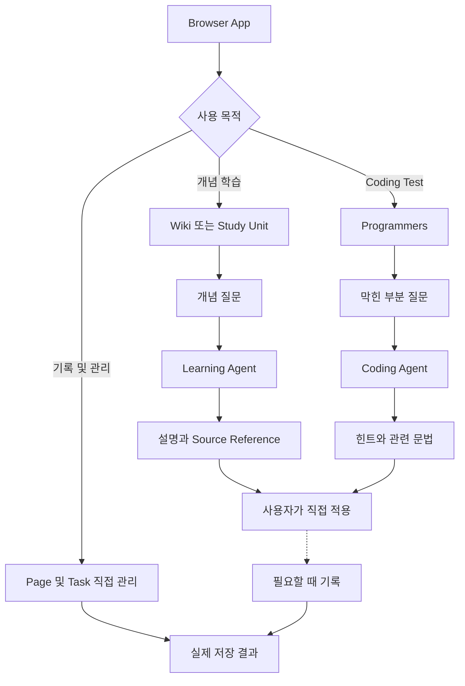

# User Flow

개정일: 2026-10-04
상태: 사용자 흐름 확정. 아래 흐름은 아직 구현하거나 실행 검증하지 않았다.

이 문서는 사용자가 시작하고 조작하며 결과를 확인하는 순서를 관리한다.
Release 범위는 [Project Plan](./PROJECT_PLAN.md)을 따른다.
기능과 완료 조건은 [PRD](./PRD.md)에 있다.
내부 실행과 저장 계약은 [Architecture](./ARCHITECTURE.md)에 있다.
작성 규칙은 [DOCUMENTATION_STYLE](./DOCUMENTATION_STYLE.md)를 따른다.

## 1. 공통 사용 흐름

사용자는 공부할 자료를 선택하거나 바로 질문할 수 있다.
Coding Test 질문에 Page 작성과 문제 등록을 먼저 요구하지 않는다.
Page와 Task는 AI 없이도 직접 관리할 수 있다.
저장과 변경의 결과는 실제 처리 결과로 표시한다.

Mermaid Source

<!-- diagram: core-user-flow -->

Algorithm 질문은 Coding Agent로 연결한다.
위 Diagram의 개념 학습 경로는 일반 기술 개념을 표시한다.
Programmers에서의 풀이 수정과 제출은 사용자가 직접 수행한다.
기록은 선택이며 공부의 완료 조건이 아니다.

## 2. 화면과 상태의 공통 규칙

- 질문 전에 활성 자료, Page, Code와 요청 설정을 확인하거나 해제할 수 있다.
- UI는 읽기, 검색, 저장과 Model 실행 상태를 구분한다.
- AI 실행을 취소해도 작성 중인 Page와 Code를 유지한다.
- 변경이 완료됐으면 실제 대상과 저장 결과를 보여준다.
- 실패했으면 실패한 동작과 재시도 가능한 범위를 보여준다.
- 이미 저장한 변경과 아직 실행하지 않은 변경을 구분한다.
- 제공 전 기능은 완료된 기능처럼 표시하지 않는다.

## 3. UF-01. 처음 시작하기와 다시 열기

연결 요구사항: FR-01, FR-07, FR-09, FR-10, FR-13, FR-20.
시작 조건: 사용자가 Windows에서 Local App을 연다.

1. App은 설정, Database와 Wiki 연결 상태를 확인한다.
2. 사용자는 기본 화면에서 Wiki, Study, Page와 Task로 이동한다.
3. API Key가 있으면 Chat을 사용한다.
4. API Key가 없으면 AI 설정 안내를 보고 수동 기능을 사용한다.
5. 이전 저장 내용이 있으면 최근 학습 대상과 Session을 다시 연다.

결과: 사용자는 Layout 설정 없이 공부를 시작한다.
Runtime 자산이 준비되지 않았으면 준비 상태와 실패 원인을 표시한다.
Wiki 연결 실패가 Page와 Task 사용을 막지 않는다.
Model 연결 실패를 Page 저장 실패로 표시하지 않는다.

## 4. UF-02. Wiki로 개념 이해하기

연결 요구사항: FR-01, FR-02, FR-04, FR-10.
처리 경로: Learning Agent.

1. 사용자는 제목, Alias 또는 한국어 표현으로 Wiki를 검색한다.
2. 결과의 제목과 검색 구간을 확인하고 원문을 연다.
3. 필요한 Section과 설명 난이도를 선택한다.
4. 질문하거나 선택한 개념의 설명을 요청한다.
5. 답변에서 개념, 작은 사례와 사용 조건을 확인한다.
6. Source Reference로 실제 읽은 구간을 연다.
7. 필요한 경우 자신의 설명을 Page에 남긴다.

결과: 사용자는 설명과 근거를 연결해서 확인한다.
이해 확인을 요청한 경우에만 짧은 확인 질문을 제공한다.
검색 결과가 없으면 확인한 검색 범위를 알린다.
File Version이 바뀌면 변경 상태를 알리고 최신 목차를 다시 조회한다.
자료가 불일치하면 각 근거와 확인하지 못한 내용을 구분한다.

## 5. UF-03. 분야와 난이도의 Track에서 공부하기

연결 요구사항: FR-03, FR-04, FR-09.

1. 사용자는 AI, Data, Backend, Python 또는 CS 분야를 고른다.
2. 기초, 응용, 심화 중 원하는 수준을 선택한다.
3. 작성한 Study Unit과 관련 Wiki를 구분해서 확인한다.
4. 단원의 목표, 선행 개념과 다룰 내용을 읽는다.
5. 필요한 설명, 예측, 실행 또는 수정 활동을 진행한다.
6. 자신의 설명이나 결과를 확인 기준과 비교한다.
7. 필요하면 관련 질문을 같은 Chat에서 이어 한다.

결과: 사용자는 선택한 학습 공간에서 개념을 익힌다.
상위 난이도를 잠그지 않는다.
관련 Wiki만 있고 완성 단원이 없으면 그 상태를 표시한다.
활동을 열거나 Task를 완료했다고 숙련도를 판정하지 않는다.
MCP는 별도 필수 Track이 아니라 실제 App 연결을 이해하는 예제로 다룬다.

## 6. UF-04. Markdown으로 Algorithm 배우기

연결 요구사항: FR-02, FR-05, FR-10.
처리 경로: Coding Agent의 algorithm 목적.

1. 사용자는 Algorithm의 개념을 바로 질문하거나 관련 Wiki를 선택한다.
2. Harness는 질문에 필요한 검토된 Concept Reference를 읽는다.
3. Coding Agent는 개념과 필요한 선행 내용을 설명한다.
4. 문제와 구분한 작은 입력으로 상태의 변화를 보여준다.
5. 사용자는 조건을 바꾼 결과와 Complexity의 이유를 확인한다.
6. 사용자는 자신의 말로 설명하거나 작은 실습에 적용한다.

결과: 사용자는 자신의 Markdown 자료로 Algorithm을 이해한다.
문제 기록과 외부 API 연결을 요구하지 않는다.
원문에 완성 풀이가 있어도 해당 구간을 기본 AI Context에 넣지 않는다.
자료가 부족하면 부족한 근거와 필요한 개념을 알린다.
현재 Coding Test와 연결된 질문이면 같은 정답 제공 제한을 유지한다.

## 7. UF-05. Programmers에서 막힌 부분 질문하기

연결 요구사항: FR-05, FR-06, FR-10, FR-11.
처리 경로: Coding Agent의 coding_test 목적.
시작 조건: 사용자가 Programmers에서 문제를 직접 풀고 있다.

1. 사용자는 막힌 부분이나 궁금한 문법을 Chat에서 질문한다.
2. 필요하면 자신의 문제 요약, 접근, 실패 입력과 Code를 선택한다.
3. App은 현재 대상과 해당 Turn의 Code Snapshot을 표시한다.
4. Coding Agent는 바로 설명하거나 꼭 필요한 조건만 짧게 묻는다.
5. 사용자는 힌트, 관련 문법과 다음 점검 한 단계를 확인한다.
6. 사용자는 Programmers로 돌아가 판단하고 Code를 직접 수정한다.
7. 다시 질문하면 같은 문제와 앞선 안내를 기준으로 이어 간다.

결과: 사용자가 문제를 해결하는 주체로 남는다.
Coding Record가 없어도 질문할 수 있다.
정답을 요청하면 개념과 점검 방향으로 안내한다.
다른 Role로 요청해도 현재 문제의 완성 답안을 제공하지 않는다.
문법 예제는 해당 문제의 핵심 풀이를 복제하지 않는 작은 상황을 사용한다.
반복 힌트로 전체 풀이를 조립하지 않는다.
원문과 실패 입력을 확인하지 못했으면 원인 후보로 표시한다.

다른 문제를 시작하면 활성 문제, Page와 Code 참조를 갱신한다.
앞선 문제의 조건과 Code를 새 문제에 사용하지 않는다.
AI가 실제로 실행하지 않은 반례를 실행 결과로 표시하지 않는다.
외부 제출과 공식 판정은 Programmers에서 확인한다.

## 8. UF-06. 메모와 보조 오답노트 작성하기

연결 요구사항: FR-07, FR-08, FR-13, FR-20.
처리 경로: 수동 Page 조작 또는 명확한 App 관리 요청.

1. 사용자는 새 Page를 만들거나 기존 Page를 연다.
2. 개념 정리는 자신의 설명과 원문 참조를 작성한다.
3. Coding Record는 제목과 문제 URL부터 저장한다.
4. 필요한 접근, 내 Code, 실패 원인과 배운 점만 추가한다.
5. Block을 직접 수정하거나 내부 순서를 바꾼다.
6. 실제 저장 완료 상태를 확인하고 다시 연다.
7. 필요하면 해당 Page에 연결한 복습 Task를 직접 만든다.

결과: 사용자 기록은 일반 Page와 같은 구조로 보존된다.
오답노트 작성 수량을 요구하지 않는다.
같은 URL이면 기존 기록을 먼저 보여주고 자동 병합하지 않는다.
외부 판정과 복습 상태는 사용자가 직접 갱신한다.
AI 검토와 App Test Case 결과가 외부 판정을 바꾸지 않는다.

저장 실패 시 작성 내용을 유지한다.
Revision이 달라졌으면 최신 내용과 자신의 Draft를 비교한다.
사용자가 요청한 기록 반영은 실제 대상과 최신 Revision을 확인한다.
Coding Agent가 직접 Page를 쓰지 않는다.

## 9. UF-07. Python 기초 실습하기

연결 요구사항: FR-03, FR-06, FR-09, FR-20.
처리 경로: App Practice 기능. Python 실행은 Agent가 수행하지 않는다.

1. 사용자는 작은 Practice Problem의 목표, 제약과 Function 계약을 읽는다.
2. 제공한 입력의 결과를 예측하고 Monaco Editor에 Code를 작성한다.
3. 실행이나 Test Case 실행을 선택한다.
4. App은 Code Draft를 저장하고 실행 Snapshot을 만든다.
5. 별도 Origin의 Runtime이 실제 Python을 실행한다.
6. 사용자는 출력, 비교 결과와 실패 종류를 확인한다.
7. Code를 직접 수정하고 다시 실행한다.
8. 막힌 개념과 문법만 Coding Agent에 질문한다.

결과: Code와 실제 실행 결과를 함께 확인한다.
무한 실행이나 큰 출력은 설정한 제한으로 중단한다.
중단과 오류 후에도 Draft를 유지한다.
Runtime 준비 실패와 Code 실패를 구분한다.
표시는 제공 Test Case의 통과 또는 실패다.
이를 Programmers 통과와 Algorithm Complexity의 증명으로 사용하지 않는다.

## 10. UF-08. 같은 Chat에서 이어서 질문하기

연결 요구사항: FR-10, FR-11.

1. 사용자는 기존 Session을 연다.
2. 현재 자료, Page, 문제와 요청 설정을 확인한다.
3. 앞선 질문에 이어 질문하거나 새로운 목적을 명시한다.
4. Supervisor는 현재 목적의 Role을 선택한다.
5. Harness는 필요한 대화와 최신 대상을 조회한다.
6. 사용자는 답변의 대상과 근거를 확인한다.

결과: 같은 Session에서 Role이 바뀌어도 관련 요청 조건을 유지한다.
공고 분석 뒤 일반 RAG 개념을 물으면 Learning Agent로 연결한다.
현재 Coding Test의 답을 다른 Role에 요청하면 같은 제한을 유지한다.
오래된 대화가 Context에 없으면 필요한 기록을 다시 읽거나 그 범위를 알린다.

새 Session은 이전 활성 Context를 사용하지 않는다.
Session 삭제는 연결 Page와 Task를 삭제하지 않는다.
한 Session의 AI 요청은 한 번에 하나씩 처리한다.
취소한 Turn은 완료 답변으로 표시하지 않는다.
취소 전에 저장한 변경은 실제 결과로 남긴다.

## 11. UF-09. Task를 직접 관리하거나 Chat으로 요청하기

연결 요구사항: FR-11, FR-13.

1. 사용자는 Task를 직접 추가하거나 명확한 생성 요청을 한다.
2. 제목과 선택적 마감 및 학습 대상을 입력한다.
3. App은 같은 Task Service로 검증하고 저장한다.
4. 사용자는 생성한 Task와 저장 결과를 확인한다.
5. Task에서 연결한 자료, Study Unit 또는 Page를 연다.
6. 완료, 완료 취소, 수정, 보관과 복원을 직접 수행한다.

결과: 사용자가 할 일을 직접 관리한다.
날짜가 없는 Task도 저장한다.
대상이 모호하면 해당 대상만 확인한다.
명확한 단일 변경에 반복 승인을 요구하지 않는다.
같은 요청의 재시도로 Task를 중복 생성하지 않는다.
완료 상태를 숙련도와 외부 문제 통과로 바꾸지 않는다.

## 12. UF-10. Calendar와 Planner로 공부 시간 배치하기

연결 요구사항: FR-13, FR-14, FR-15.
제공 시점: Project Plan의 후속 범위를 따른다.

1. 사용자는 목표와 공부 가능 시간을 설정한다.
2. 배치할 Task와 직접 입력한 예상 시간을 선택한다.
3. Planner는 가능 시간, 총 배치 시간과 겹침을 보여준다.
4. 사용자가 직접 시간을 지정하거나 AI 배치안을 요청한다.
5. AI 제안은 미리보기에서 원하는 Event만 선택한다.
6. 적용 후 Calendar에서 실제 저장 결과를 확인한다.
7. 사용자는 Event를 직접 수정, 이동하거나 삭제한다.

결과: Task와 공부 시간을 연결하되 각각의 의미를 유지한다.
Event 이동으로 Task의 마감을 바꾸지 않는다.
Event 삭제로 Task를 삭제하지 않는다.
시간이 부족하거나 예상 시간이 없으면 해당 상태를 표시한다.
AI가 새 단원, 예상 시간과 반복 일정을 임의로 채우지 않는다.
미완료 작업은 사용자가 재배치한다.

## 13. UF-11. 채용공고 분석과 준비 내용 연결하기

연결 요구사항: FR-04, FR-12, FR-13, FR-16.
처리 경로: Job Agent. 필요한 기술 설명만 Learning Agent로 연결한다.

1. 사용자는 공고 URL 또는 본문을 제공한다.
2. 조건 검색이 필요하면 직무, 경력과 지역을 명시한다.
3. Job Agent는 확인한 공고 근거를 읽는다.
4. 필수, 우대, 경력 조건과 확인한 마감을 구분한다.
5. 사용자가 제공한 경험과 요구사항을 비교한다.
6. 사용자는 확인한 경험, 준비 후보와 미확인 항목을 확인한다.
7. 원하는 후보의 Wiki 또는 Study Unit을 연다.
8. 필요하면 공고 보관, Task 생성과 일정 배치를 명확히 요청한다.

결과: 공고의 근거와 실제 준비 내용을 연결한다.
Profile 등록을 선행 조건으로 요구하지 않는다.
Wiki 보유를 사용자의 경험과 숙련으로 해석하지 않는다.
원문을 읽지 못하면 제공 본문에 근거한 분석임을 표시한다.
분석 시각을 현재 모집 상태 확인 시각으로 바꾸지 않는다.
마감이 없으면 날짜를 만들지 않는다.
지원 상태는 사용자가 직접 관리한다.
자동 지원, 합격 예측과 Mail 전송은 수행하지 않는다.

## 14. UF-12. 최신 자료를 웹에서 확인하기

연결 요구사항: FR-04, FR-11, FR-12, FR-16.
처리 경로: Web Search가 허용된 Role.

1. 사용자는 검색을 요청하거나 웹 포함 모드를 선택한다.
2. App은 요청에 필요한 공개 검색어를 만든다.
3. 기술 자료는 공식 문서와 논문을 우선한다.
4. 실제로 읽은 결과를 해당 질문의 Context로 전달한다.
5. 사용자는 URL, 확인 시각과 확인한 내용을 본다.
6. Wiki 내용과 최신 웹 내용의 차이를 확인한다.

결과: 기존 Wiki에 없거나 최신 확인이 필요한 내용을 보완한다.
이미 요청한 검색의 승인을 다시 묻지 않는다.
검색 실패는 실패로 표시하고 읽었다고 답하지 않는다.
저장한 URL을 자동 분석하지 않는다.
Coding Agent에 Web Search Tool을 추가하지 않는다.
현재 Coding Test의 정답 제공 제한은 자료 모드가 바뀌어도 유지한다.

## 15. UF-13. Drag and Drop으로 작업 공간 정리하기

연결 요구사항: FR-07, FR-14, FR-18, FR-19.
각 조작의 제공 시점은 Project Plan을 따른다.

### Page 내부 Block 이동

1. 사용자는 Block Handle을 선택한다.
2. 같은 Page 안의 원하는 위치로 옮긴다.
3. Block 내용과 ID를 보존하고 순서를 저장한다.
4. 다시 열어 저장한 순서를 확인한다.

### 메뉴에서 Page로 Block 추가

1. 사용자는 메뉴의 Block 종류를 선택한다.
2. Page의 허용 Drop 위치로 옮긴다.
3. App은 해당 Block을 한 번 추가한다.
4. 사용자는 내용을 작성하고 저장 상태를 확인한다.

### Widget 이동과 크기 변경

1. 사용자는 Page, Task 또는 Calendar Widget을 연다.
2. Widget Handle로 이동하거나 크기를 바꾼다.
3. App은 원본 내용과 별도로 Layout을 저장한다.
4. 다시 열거나 기본 Layout으로 돌아간다.

결과: 세 조작이 서로의 입력을 가로채지 않는다.
Widget 닫기는 원본 삭제가 아니다.
Calendar 내부 시간 이동은 Widget 위치 변경과 구분한다.
사용자는 직접 추가와 이동 메뉴 등 대체 조작도 사용할 수 있다.
통합 검색은 실제 대상만 열고 내용을 복제하지 않는다.

## 16. UF-14. Backup과 Restore로 기록 보존하기

연결 요구사항: FR-07, FR-08, FR-10, FR-13, FR-20.

1. 사용자는 App Data의 Backup을 만든다.
2. App은 SQLite Backup과 Schema 정보를 저장한다.
3. 사용자는 Backup 결과를 확인한다.
4. Restore가 필요하면 App을 종료한다.
5. Restore 절차는 Backup의 유효성과 Schema를 검사한다.
6. 검증에 성공하면 현재 Data를 보존한 뒤 적용한다.
7. 사용자는 App을 다시 열고 Page, Task와 Session을 확인한다.
8. Wiki 설정과 변경된 Source Reference를 확인한다.

결과: App Data와 연결 관계를 복원한다.
원래 Wiki는 App Backup에 포함하지 않는다.
손상되거나 맞지 않는 Backup은 적용하지 않는다.
Markdown Export만으로 Block ID와 연결 관계를 복원한다고 표시하지 않는다.
Restore 실패를 정상 완료로 바꾸지 않는다.

## 17. UF-15. Baseline과 RAG 검색을 비교하기

연결 요구사항: FR-01, FR-02, FR-06, FR-21.
시작 조건: Baseline을 실제로 사용하고 검색 실패 사례를 확인했다.
이 흐름은 개발 및 학습용 E1 실험이다.
일반 사용자가 먼저 설정해야 하는 기능이 아니다.

1. 실제 학습 질문 15~20개와 기대 근거를 고른다.
2. Wiki 집합과 Version을 고정한다.
3. Keyword Search의 결과를 기록한다.
4. Section과 Embedding으로 파생 Index를 만든다.
5. 같은 Model, Prompt와 Context 예산으로 검색 방식을 비교한다.
6. 근거 검색, 답변 일치, 없는 자료와 정답 노출을 검토한다.
7. 문서 수정 및 삭제 후 Index 갱신을 확인한다.
8. 시간과 확인 가능한 비용을 비교한다.
9. 효과가 있는 범위와 기본 적용 여부를 결정한다.

결과: RAG 구성과 실패 원인을 직접 익힌다.
Markdown 원본을 수정하지 않는다.
Coding Agent의 허용 Concept Reference를 실험에서도 유지한다.
검색 실패와 답변 해석 실패를 분리한다.
성능이 나아지지 않은 질문도 결과에 남긴다.
비교 전에 Embedding 검색을 기본 사용 흐름으로 바꾸지 않는다.

## 18. 요구사항과 Flow 연결

| Flow | 주요 FR | 확인할 결과 |
|---|---|---|
| UF-01 | FR-01, FR-07, FR-09, FR-10, FR-13, FR-20 | 시작, 실패 구분과 다시 열기 |
| UF-02 | FR-01, FR-02, FR-04, FR-10 | 개념 설명과 실제 근거 |
| UF-03 | FR-03, FR-04, FR-09 | 분야와 난이도의 학습 활동 |
| UF-04 | FR-02, FR-05, FR-10 | Markdown 기반 Algorithm 이해 |
| UF-05 | FR-05, FR-06, FR-10, FR-11 | 정답 없는 도움과 사용자 적용 |
| UF-06 | FR-07, FR-08, FR-13, FR-20 | 직접 작성한 기록의 보존 |
| UF-07 | FR-03, FR-06, FR-09, FR-20 | 실제 실행과 실패 확인 |
| UF-08 | FR-10, FR-11 | Multi-turn과 목적 전환 |
| UF-09 | FR-11, FR-13 | 직접 관리와 같은 저장 경로 |
| UF-10 | FR-13, FR-14, FR-15 | 시간 배치와 사용자 제어 |
| UF-11 | FR-04, FR-12, FR-13, FR-16 | 공고 근거와 준비 내용 |
| UF-12 | FR-04, FR-11, FR-12, FR-16 | 최신 공개 자료 확인 |
| UF-13 | FR-07, FR-14, FR-18, FR-19 | 세 종류의 조작과 실제 대상 열기 |
| UF-14 | FR-07, FR-08, FR-10, FR-13, FR-20 | 검증한 복원 |
| UF-15 | FR-01, FR-02, FR-06, FR-21 | 검색 비교와 적용 판단 |

FR-17의 하위 Page와 Template은 UF-06의 Page 사용을 확장한다.
후속 기능도 같은 저장 실패, Revision과 직접 편집 기준을 따른다.
Flow의 단계 수와 문서 검토는 실제 실행 Test 결과가 아니다.
